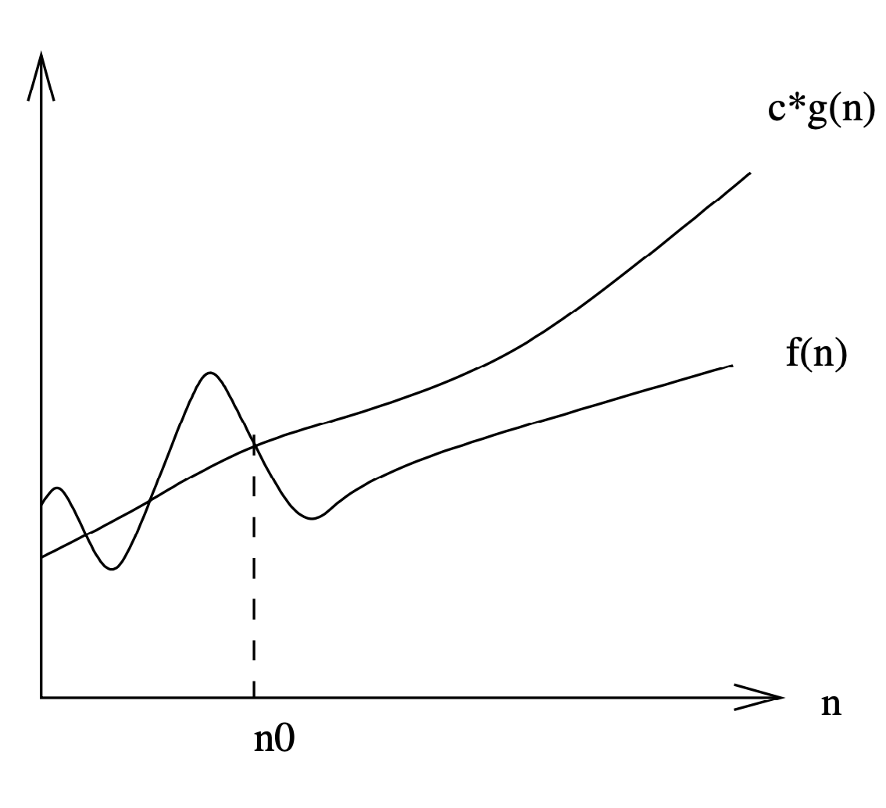
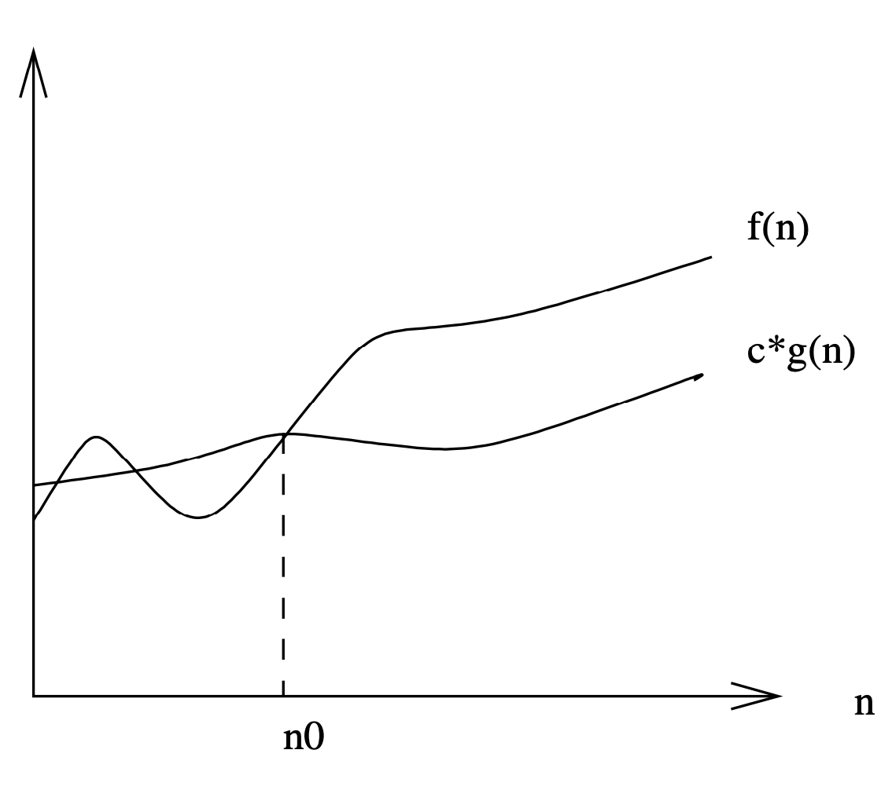
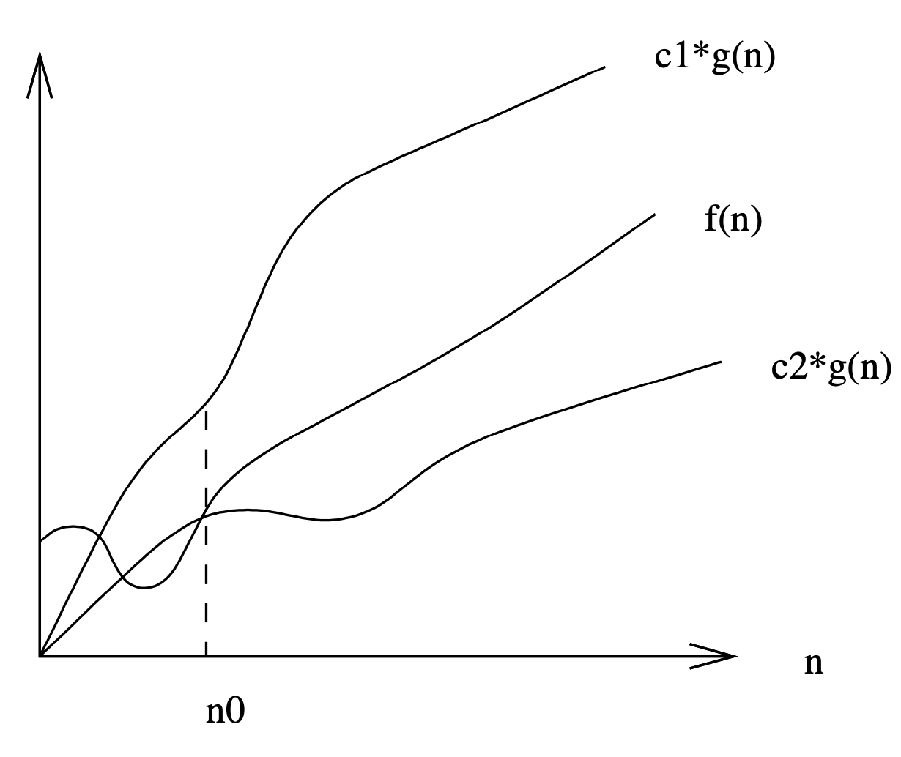

2.2: The Big Oh Notation
===

The formal definitions associated with the Big Oh notation are as follows:

```
f(n) = O(g(n)) means c*g(n) is an upper bound on f(n). Thus there exists some
constant c such that f (n) is always ≤ c*g(n), for large enough n (i.e.  ,n ≥ n0
for some constant n0). 
```

```
f(n) = Ω(g(n)) means c*g(n) is a lower bound on f(n). Thus there exists some
constant c such that f(n) is always ≥ c*g(n), for all n ≥ n0. 
```

```
f(n) = Θ(g(n)) means c1*g(n) is an upper bound on f(n) and c2*g(n) is a lower
bound on f(n), for all n ≥ n0\. Thus there exist constants c1 and c2 such that f
(n) ≤ c1*g(n) and f (n) ≥ c2*g(n). This means that g(n) provides a nice, tight
bound on f(n).
```






