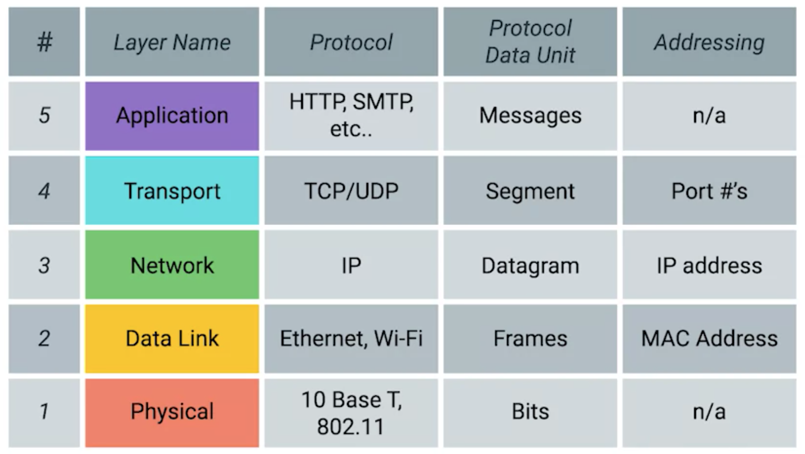
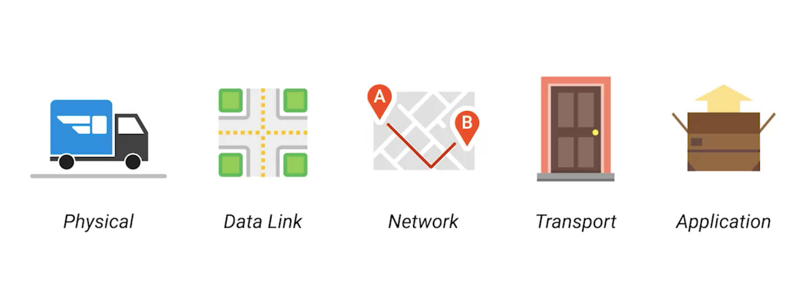
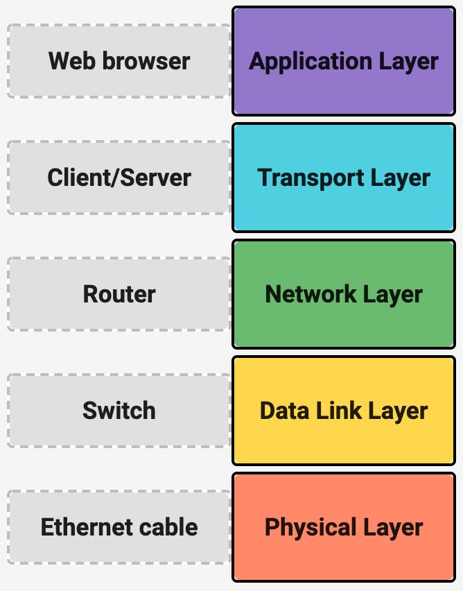

The TCP IP Five Layer Network Model
===

The Five Layers
---

Starting from bottom:

- **Physical**: represents the physical devices that interconnect computers
- **Data Link**: responsible for defining a common way of interpreting signals
  so network devices can communicate (eg. ethernet, wireless)
- **Network**: allows different networks to communicate with each other (through
    routers)

!!! note "Internetwork"
    A collection of networks connected together through routers, most famous of
    these being the Internet. 

!!! note "Data Link vs Network"
    Data Link is responsible for getting data across a single link; network
    layer is responsible for getting data across a collection of networks.

!!! note "IP"
    Most common protocol at the network layer is the Internet Protocol.

- **Transport**: sorts out which client and server programs are supposed to get
  the data being sent (a node can run multiple clients -- like chrome, email)
- **Application**: http, smtp etc.

Analogy with package delivery:

Networking devices, and the layers they operate at:

