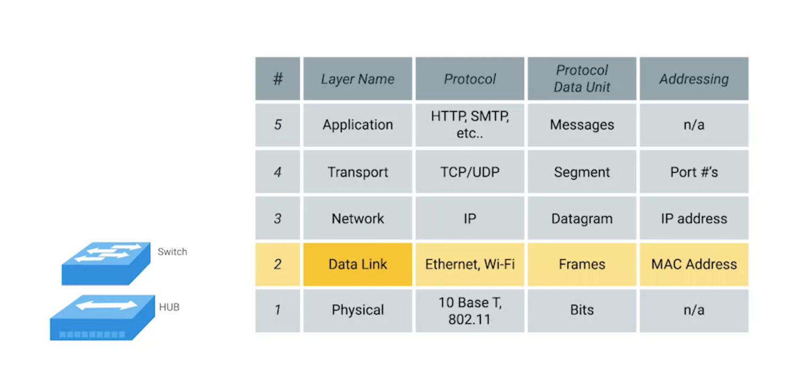
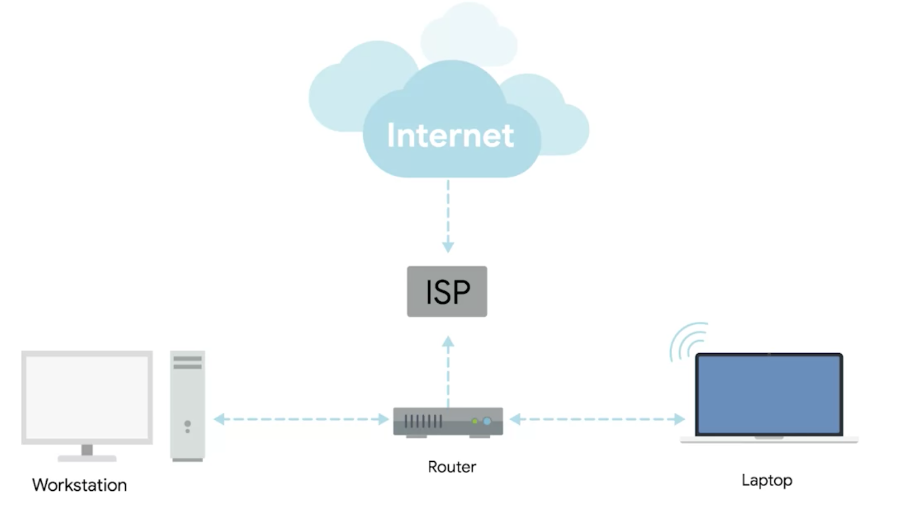

The Basics of Networking Devices
===

Hubs and Switches
---

Hubs allow for connections to many computers at once, but result in collisions.
As a result, devices need to wait, slowing down communications. Less used today.

A switch solves this problem. Hubs operate on layer 1, whereas switches operate
on layer 2. This means a switch can inspect the contents of the data being sent.

Router
---

A router is a device that knows how to forward data between independent
networks. It operates on layer 3.

