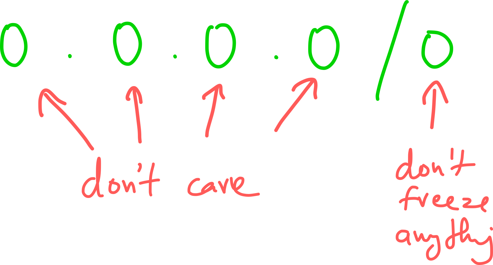

CIDR
===

Resources
---

- [:fontawesome-brands-aws: Understanding CIDR Notation][1]
- [:fontawesome-solid-play-circle: IPv4, CIDR, and VPC Subnets Made Simple!][2]
- [:fontawesome-solid-link: Visualize CIDRs][3]
- [:fontawesome-solid-link: Subnetting tool][4]

<!-- Links -->
[1]: https://www.aws.training/Details/Video?id=16480
[2]: https://www.youtube.com/watch?v=z07HTSzzp3o&t=745s
[3]: https://cidr.xyz/
[4]: https://www.davidc.net/sites/default/subnets/subnets.html

Basics
---

CIDR: Classless Inter Domain Routing

An IPv4 IP address is made up of 32 bits:

If we want a representation of all IPs starting with `10.10`, we can use the
CIDR representation as:

!!! note "number of hosts"
    `10.10.0.0/16` will give us a total of `256*256` hosts. Similarly,
    `10.10.0.0/24` will give us a total of `256` hosts.

!!! note "single IPv4 address"
    A single IPv4 address in CIDR notation is: `10.10.101.5/32`.

All Wildcards
---

If we want to represent the entire set of possible IPv4 addresses:

Example
---

Use [:fontawesome-solid-link: this][3] and [:fontawesome-solid-link: this][4] to
visualize.

Let's say VPC CIDR is: `10.0.0.0/26`, which means 64 total IPs (62 usable).

We can subnet this VPC into two subnets, having the following CIDRs:

- `10.0.0.0/27`
- `10.0.0.32/27`

