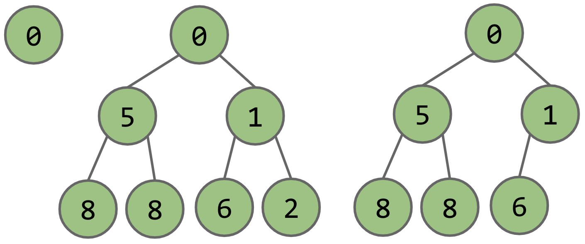
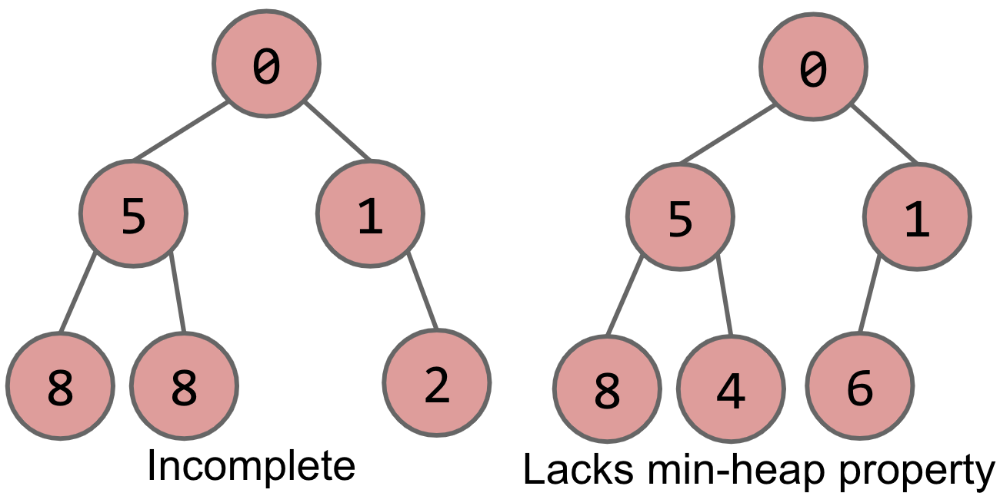
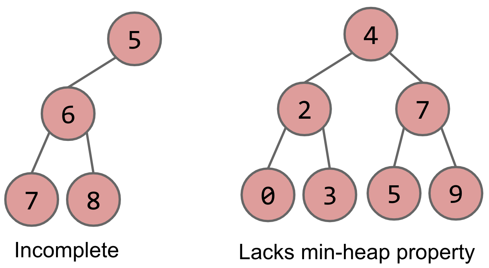
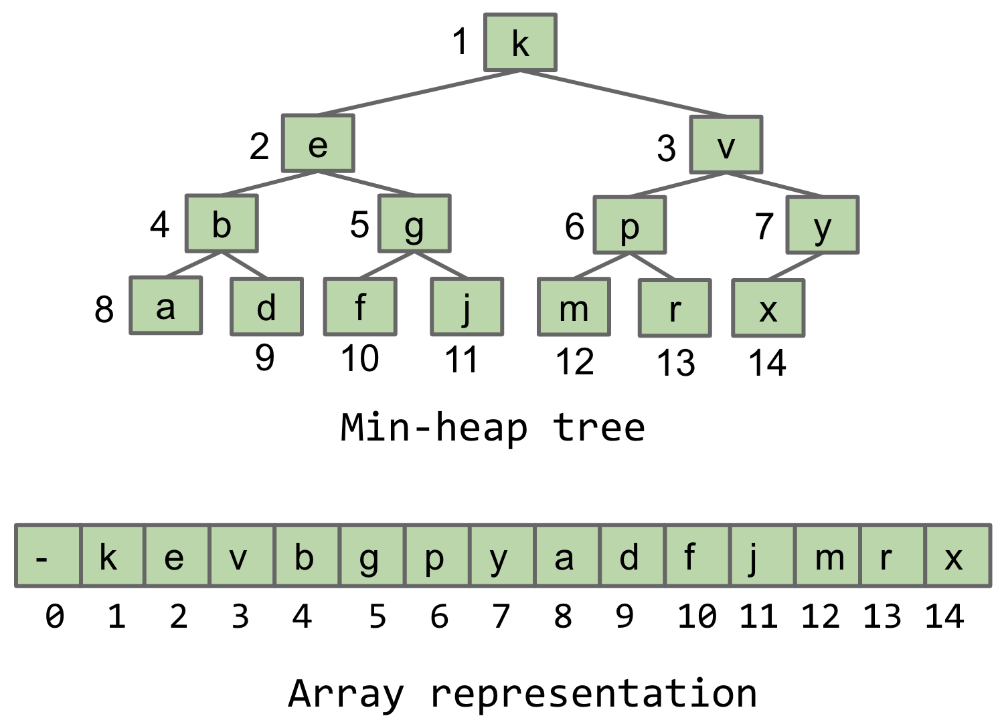

Heaps and Primary Queues
===

Resources
---

- [:fontawesome-solid-play-circle: Lectures](https://www.youtube.com/playlist?list=PL8FaHk7qbOD50LnOXTSpYgnVJQTIVFsmI)
- [:fontawesome-solid-link: Slides](https://docs.google.com/presentation/d/1XgdL3QTKYRAVa14qQznoVORqrPug5tNdmiDmbqM5FlE/edit?usp=sharing)
- [:fontawesome-solid-link: Guide](https://sp19.datastructur.es/materials/lectures/lec20/lec20)
- [:fontawesome-solid-link: GeeksforGeeks](https://www.geeksforgeeks.org/heap-data-structure/)


Motivation
---

Till now we've seen data structures that let us search individual data items
based on some kind of identifier (eg. a key, or a label). Let us move on to a
use case where we'd need to keep track of the smallest item (or largest, or the
"best" item, based on a specific metric) amongst a bunch of items. Primary
Queues solve this problem.

Let's consider a scenario to explore this use case. Suppose we're monitoring a
stream of tweets sent by a pool of users, and, at the end of each day, we need
to create a report of the most `M`(`M` is a number) vicious tweets of that day.
A naive approach to do this would be to create a list of tweets sent in a day;
then sort the list in decreasing order of viciousness (using some sort of
comparator), and finally return the first `M` tweets.

This approach will work; however, it potentially uses a large amount of memory
(of the order `Θ(N)`, where `N` is the number of tweets from a day). The goal
for this exercise — and a motivation for priority queues — is to do the same
using only `Θ(M)` memory. Let's see two approaches to solve this problem — the
first being the naive approach described above; the second uses a primary queue
— in pseudocode.

```
// Naive approach
- initialize allMessages as a list
- start streaming tweets at start of day
- on new tweet arrival
	- allMessages.add(newTweet)
- at end of day
	sort allTweets
- return allTweets.sublist(0,M)

// Using a primary queue
- intialize tweetsPQ as a primary queue (that tracks
least vicious tweet)
- start streaming tweets at start of day
- on new tweet arrival
	- tweetsPQ.add(newTweet)
	- if tweetsPQ.size() > M: tweetsPQ.removeSmallest()
- at end of day
	- initialize mostViciousTweets as a list
	- for (i=0; i<tweetsPQ.size(); i++): mostViciousTweets.add(tweetsPQ.removeSmallest())
- return mostViciousTweets
```

Using the second technique, we won't have to store all of the streaming tweets
in memory, we'd only be storing (upto) `M` most vicious tweets at any point in
time. Pretty cool! Also, as seen above, the key operations of a priority queue
are:

- `pq.add()`
- `pq.removeSmallest()`

A few more operations that would make the priority queue data structure more
useful:

- `pq.getSmallest()` (getting the value of the smallest item, without removing
it)
- `pq.size()`

Underlying data structure
---

Let's consider options for the underlying data structure for implementing a
priority queue. We could do it by using an ordered array or a bushy Binary
Search Tree. Let's go through the worst case runtimes for both of them:

Ordered Array
---

- `add` will take `Θ(N)` time, as the array will have to be ordered every time
a new item is added.
- `getSmallest` will take constant time, as it will always be the first element
in the array.
- `removeSmallest` will take `Θ(N)` time in the worst case, as the array will
have to be resized.

Bushy BST
---

`add` operation corresponds to a normal insertion in a bushy BST. `getSmallest`
and `removeSmallest` correspond to searching the tree for the smallest item
(traverse left till a leaf is reached). All three will take `Θ(log N)` time in the
worst case. But, dealing with duplicates in a BST is tricky, and a priority
queue can have duplicates. This makes a BST a bad contender for this use case.

The worst case runtimes for these two data structures can be summarized as
follows.

|  Operation     | Ordered Array | Bushy BST |
|----------------|---------------|-----------|
| add            | Θ(N)          | Θ(log N)  |
| getSmallest    | Θ(1)          | Θ(log N)  |
| removeSmallest | Θ(N)          | Θ(log N)  |

We need a specialized data structure that caters to the very specific needs of a
priority queue.

Heap
---

Heaps are a great way to implement a priority queue. Specifically, let's take a
look at a **binary min-heap**, a data structure that keeps track of the minimum
element amongst the items added to it. A binary min-heap is a variant of a
binary tree that has two additional properties:

- Every node is less than or equal to both of its children (**Min-heap
property)**
- It is a **complete** binary tree, ie, it is missing items only at the bottom
level (if any), and all nodes are as far left as possible.

The following three are valid binary min-heaps:



On the other hand, the following four are not binary min-heaps, due to the
reasons mentioned below each tree.





### getSmallest()

As a consequence of the min-heap property, getting the value of the smallest
item in the heap is very easy: it's always the value of the root node. As such,
`getSmallest` has a runtime of `Θ(1)`.

### add()

Adding an item to a heap is slightly more complicated; the complication arises
from the fact that the resultant structure (after insertion) must be a min-heap
itself. The following presentation describes the working of this operation.

<iframe src="https://docs.google.com/presentation/d/e/2PACX-1vQyr2OtkVJpvbv1bDlmGaVi36heVBVvMnmAchIXm7qwMHFed1t59uKSD4C-s7kI-ce1W7EZxe5G_j2R/embed?start=false&loop=true&delayms=60000" frameborder="0" width="960" height="569" allowfullscreen="true" mozallowfullscreen="true" webkitallowfullscreen="true"></iframe>

### removeSmallest()


Removing an item means changing the value of the root node in the tree. Since
the resultant tree has to be a min-heap, we need to replace it with an
appropriate element from the heap itself. The following presentation describes this
operation.

<iframe src="https://docs.google.com/presentation/d/e/2PACX-1vTdtjjuvPYCNUTuHYWpPKK8kvSps5RVU0FXHg3yPNxWWdfpfmyxGadJqWeiSMI8IBVmLiBVWDXhXeX7/embed?start=false&loop=true&delayms=60000" frameborder="0" width="960" height="569" allowfullscreen="true" mozallowfullscreen="true" webkitallowfullscreen="true"></iframe>

Implementation
---

Next, let's see how all of this is implemented. Instead of implementing a tree
based data structure in the way we've seen before (using `left` and `right`
references), we'll implement it using an array. The reason for doing so is that
arrays lend themselves very nicely to the narrow set of operations of a min-heap
tree, as we'll see soon.

The nodes of the tree will be ordered by level, starting at root, and, from left
to right, as seen in the following image. We keep the first element in the array
empty to make the math (as we'll see soon) a bit simpler.



Let's see how this array representation makes our lives simpler.

- If we maintain a `size` variable, adding an item `newItem` to the tree is
simply assigning `array[size+1] = newItem`.
- We can find the parent of the node at index `n` at the index `floor(n/2)`.
- The left child of a node at index `n` is at index `2*n`.
- The right child of a node at index `n` is at index `2*n + 1`.

### getSmallest()

As mentioned before getting the value of the smallest item in the heap is as
simple as returning `array[1]`.

### add()

We start by adding the new item to the array. We then make the item this item
"swim up" to an appropriate position in the tree. The following video describes
the implemention in more detail.

[VID]

### removeSmallest()

We start by copying the item at index `1` for further retrieval. The item at the
last index is removed and it's contents are placed at index `1`. We then make
this item "swim down" the tree to an appropriate location. The following video
describes the implemention in more detail.

[VID]

Runtime
---

Let's summarize the worst case runtimes of the operations of a min-heap and
compare them to those of an ordered array and a bushy BST. `add` and
`removeSmallest` will take `Θ(logN)` in the worst case (when we need to "swim
up" and "swim down" the entire depth of the tree). This runtime is actually
amortized since the underlying array will need to be resized occasionally.
`getSmallest` will take `Θ(1)` time.

|  Operation     | Ordered Array | Bushy BST | Heap     |
|----------------|---------------|-----------|----------|
| add            | Θ(N)          | Θ(log N)  | Θ(log N) |
| getSmallest    | Θ(1)          | Θ(log N)  | Θ(1)     |
| removeSmallest | Θ(N)          | Θ(log N)  | Θ(log N) |
