Range Searching and Multi Dimensional Data
===

Intro
---

Let us consider a use case where we have a bunch of data points corresponding to
X-Y coordinates of celestial bodies orbiting a sun, and we need to calculate the
number of these bodies in a certain 2D range of coordinates, as shown below. Or
we might need to find the closest body to a particular one.

These operations can be listed as follows:

- 2D range searching
- Nearest neighbors

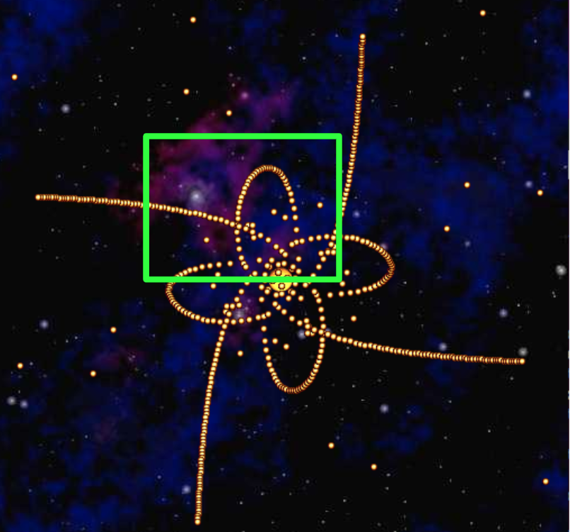.

If the data is stored as a hash table (the hashcode could be implemented using x
and y coordinates), both operations will be Θ(N), since we would have to iterate
over all items in the hash table. Let's simplify this problem by partitioning
the 2D space into bins.

Uniform Partitioning
---

The idea is to leverage the fact that by knowing the X and Y position, we can
know which bucket of the hash table a particular point will fall in.

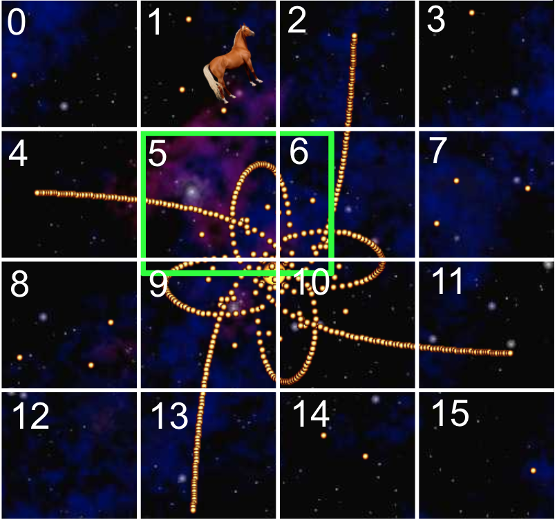

Assuming the points are evenly spread out, this would reduce the number of
points we would have to look up for both operations. However, runtimes for
both will still be Θ(N).

Trees vs Hash Tables
---

Let's think about the nature of these two data structures for this particular
problem. Search trees are all about order. As such, finding the minimum item in
a BST is Θ(log(N)), whereas, it's Θ(N) in a hash table. We can make use of this
ordered nature of search trees to improve the performance of the spatial
operations we're dealing with.

Building Trees of Two Dimensional Data
---

We need some way to compare these 2D points for storing them in a BST. These
points have X and Y coordinates, and we could either one of them to compare
points. But, we would have to choose either one of them, and stick with it.
Let's consider an example of 2 2D points.

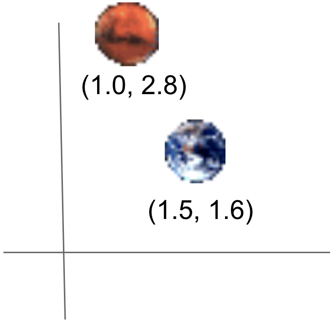

Based on whether we're using X or Y coordinates to compare, we'd end up with
either one of the following BSTs.

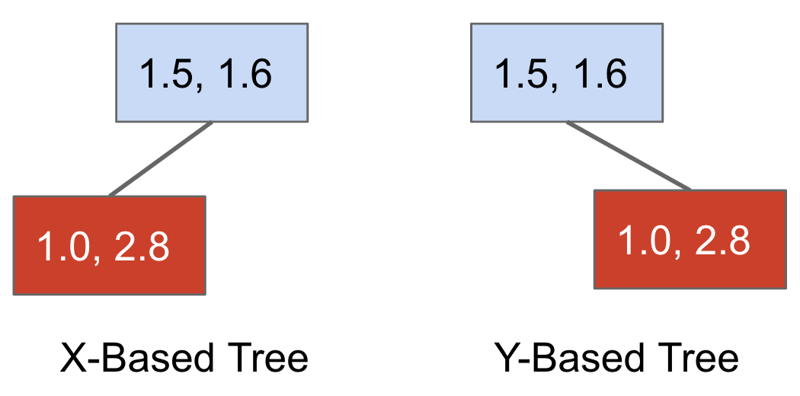

With both BST, we lose some representation of the spatial structure (since we're
only using one dimension).

Let's see this in action. We'll see two trees representing a dataset of 6 2D
points.

```
put((-1, -1), A)
put(( 2,  2), B)
put(( 0,  1), C)
put(( 1,  0), D)
put((-2, -2), E)
put((-3, 2.5), F)
```

Here's how they look in a 2D representation.

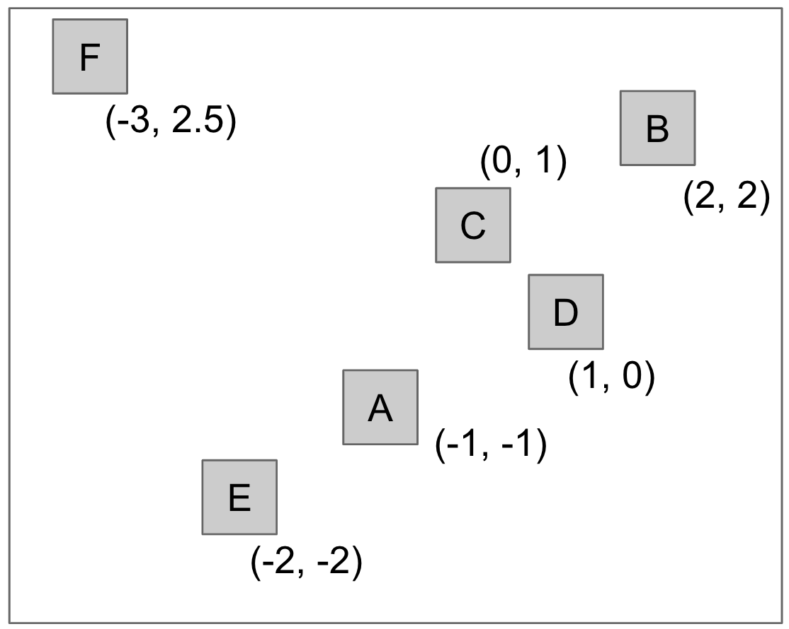

If we use the x-coordinate to compare, we get the following tree.

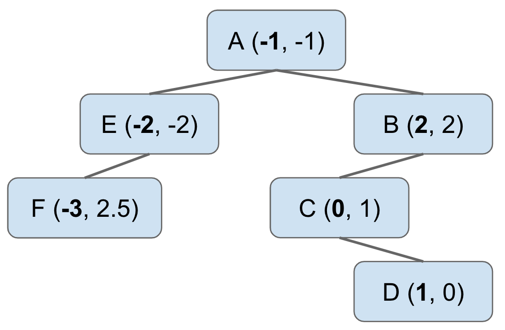

This is better than the original hash table based approach for certain
operations. Suppose we want find out the points that have X coordinate less than
`-1.5`. To do this we only need to look at the left hand child of the node `A`
in the BST, and we can discard the right hand child completely. This process of
cutting off tree search is called "pruning".

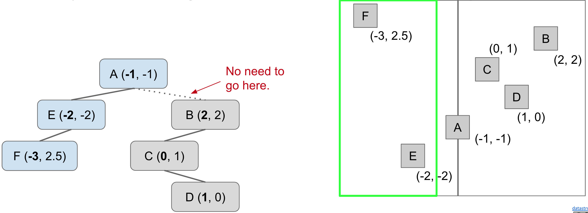

However, this won't work if we build the BST by comparing Y coordinates.

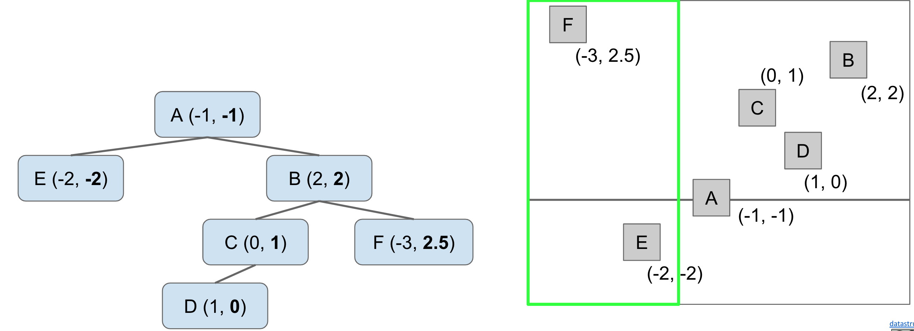

This shows the limitations of using just one coordinate to build the BST.
Fortunately, we can do better than this.

QuadTree
---

We can improve on the previous idea by building a search tree where every node
has 4 neighbors, corresponding to northwest, northeast, southwest, and southeast
directions.

<iframe src="https://docs.google.com/presentation/d/e/2PACX-1vR79QZf2x_G4i8uTgbhTPL6__gXj4q_UohvBg42g0zYzyQLKal9MUqiCAGWsJg85BJ6l4CNhOt_P3fI/embed?start=false&loop=true&delayms=60000" frameborder="0" width="960" height="569" allowfullscreen="true" mozallowfullscreen="true" webkitallowfullscreen="true"></iframe>

As with regular BSTs, the order of insertion will determine the structure of the
tree. Quadtrees are, in fact, spatial partitioning in disguise. The previous
approach resulted in a uniform grid of rectangular regions, whereas we quadtrees
we get what is called as hierarchical partitioning where each node "owns" 4
subspaces.  Also, space is more finely divided in regions where there are more
points.

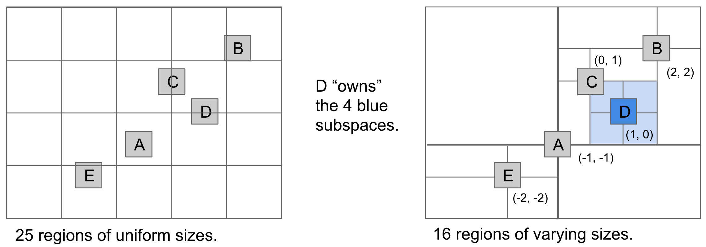

### Range Search

Let's see how the quadtree helps us out with the range search operation.

<iframe src="https://docs.google.com/presentation/d/e/2PACX-1vThT7dHKwj-8Zxkhdl_sRjRroEGTwSoq8yqgBqyNMuou7QbsBfXxjaDC-ZQffdYz0emOFkpM637reEB/embed?start=false&loop=true&delayms=60000" frameborder="0" width="960" height="569" allowfullscreen="true" mozallowfullscreen="true" webkitallowfullscreen="true"></iframe>

As seen in the video, the structure of the quadtree enabled us to prune links
much more efficiently than the uniform partitioning approach.

KD Tree
---

k-d trees are an extension of the previous idea, one that handles arbitray
number of dimensions. Let's see them in action using 2 dimensional data for the
sake of simplicity. 

For the case of 2 dimensions, the basic idea is that the root partitions the
entire space into left and right (ie, by the x dimension). All depth 1 nodes partition
the subspace into up and down (ie, by the y dimension). We keep on cycling
through the dimensions at each subsequent level. 

### Insertion

<iframe src="https://docs.google.com/presentation/d/e/2PACX-1vTpwAIEkib5GO3gztO8kBGMseFofEiyhdV-ODGfhXUeBOPU1Gn3f-Z3mkKx5SffaxzJJmGDIrVpR4Sa/embed?start=false&loop=true&delayms=60000" frameborder="0" width="960" height="569" allowfullscreen="true" mozallowfullscreen="true" webkitallowfullscreen="true"></iframe>

!!! note "We have to break ties somehow. We'll do that by saying that items that are equal in one dimension go off to the right child of each node."

### Nearest Neighbor

Searching for a node in a k-d tree is similar to a quadtree, with the difference
that each node in a k-d tree owns 2 subspaces instead of 4.

The intuition for finding the nearest neighbor using a k-d tree is that at any
node, we want to look at the "good" side of its subtree before looking at the
"bad" side.

Let's understand that through a demo. Suppose we have the following k-d tree,
and we need to find the node nearest to the point (0, 7).

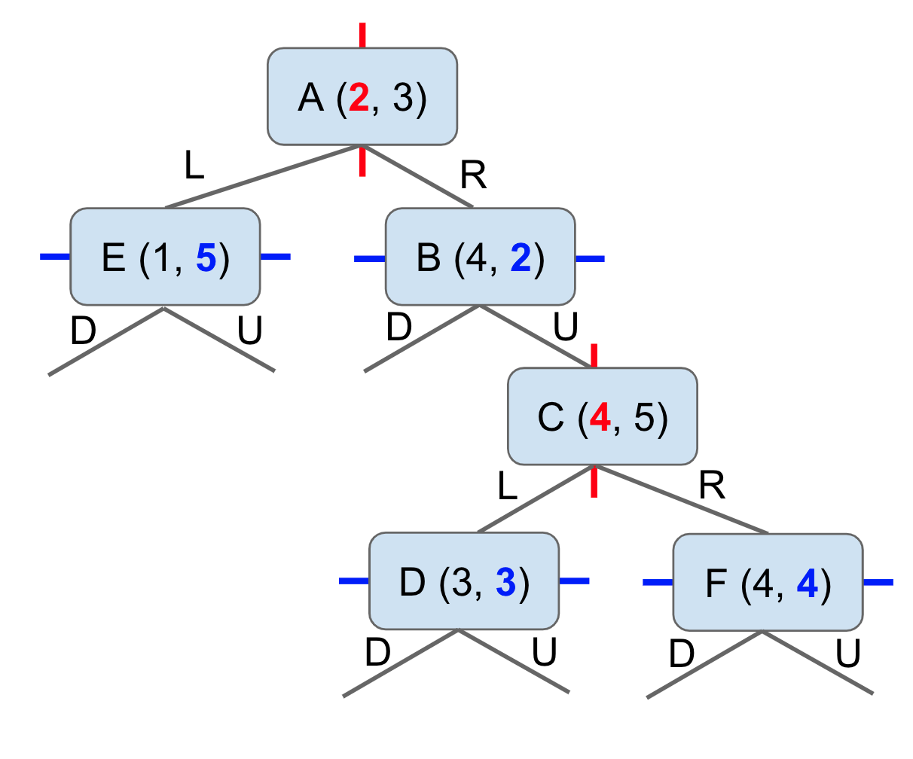

The same tree in 2D representation is as follows.

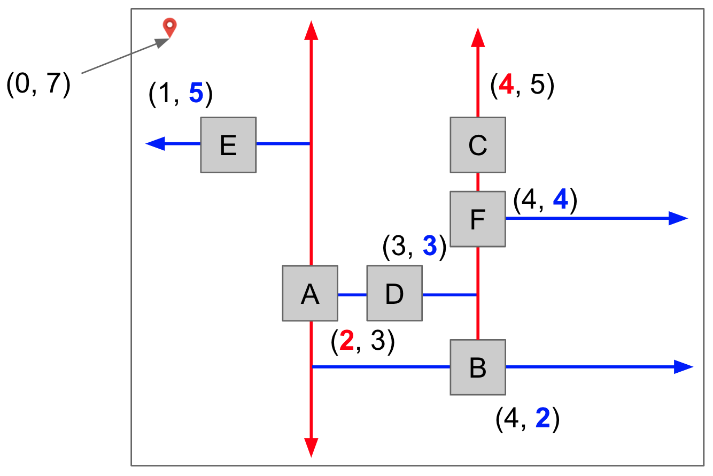

<iframe src="https://docs.google.com/presentation/d/e/2PACX-1vT_7Xrc2N4rd9r6Otp2SFZGcUqICylgUenL6meBk-iLG3k9ep7uH35KkcsF7upHSwYv9lVU-9ecfriC/embed?start=false&loop=false&delayms=60000" frameborder="0" width="960" height="569" allowfullscreen="true" mozallowfullscreen="true" webkitallowfullscreen="true"></iframe>
