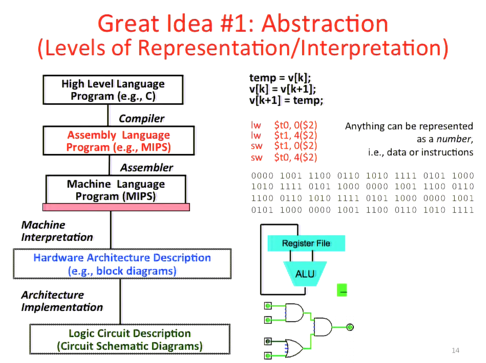
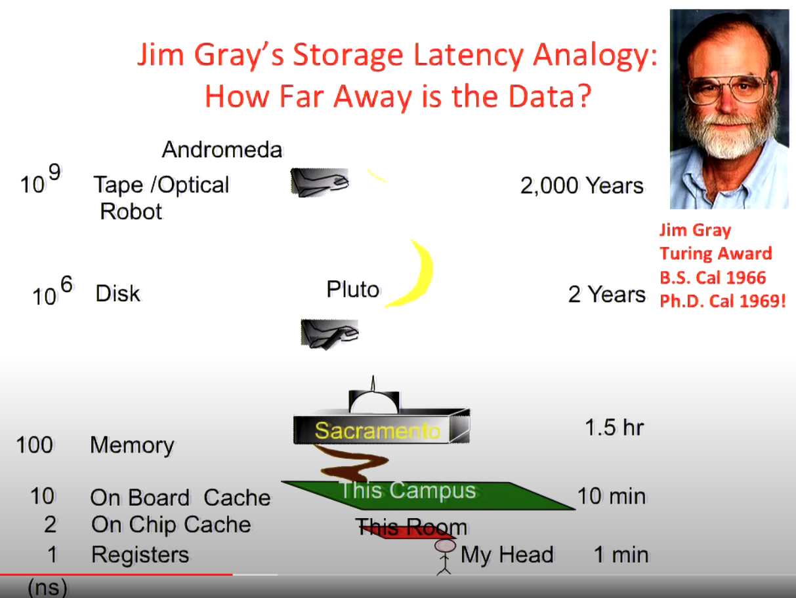
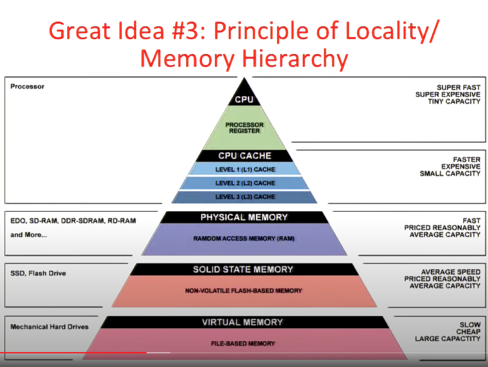
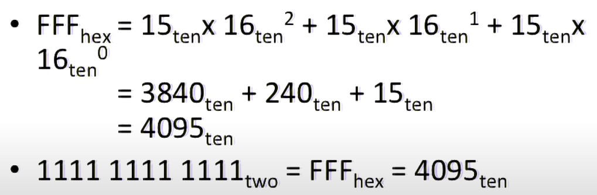
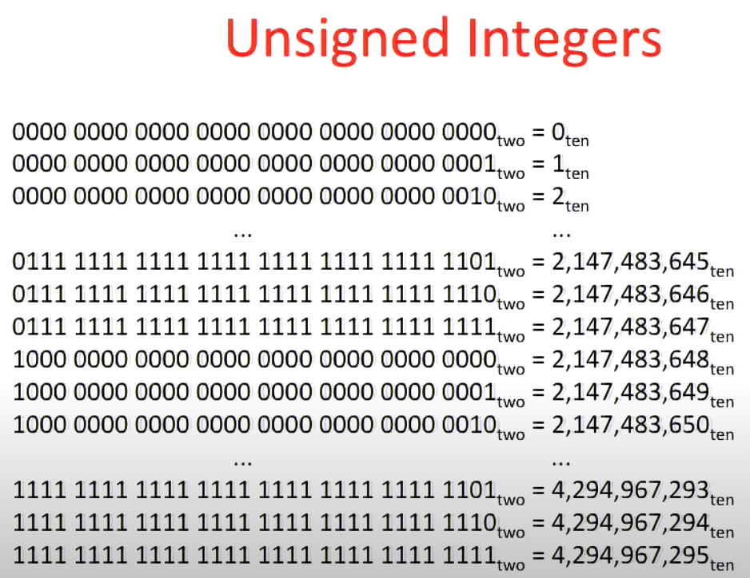
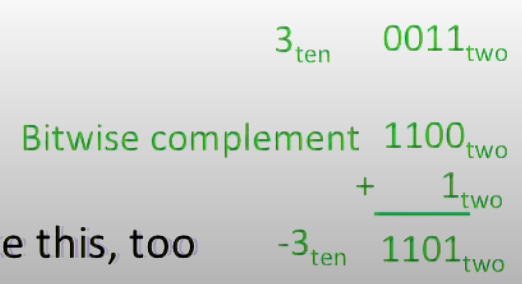

Lec 1: Intro
===

> What is hardware and how does it magically run software?

Great Ideas in Computer Architecture
---

- Abstraction
- Moore's law
- Principle of locality
- Parallelism
- Performance Measurement and Improvement
- Dependability via Redundancy

Abstraction
---

Principle of Locality
---

Accessing data from memory is very slow compared to accessing it from registers
or on chip cache. 

Given that most of the memory we use is the slower (and cheaper) kind, we can
still make things work due to the principle of locality.

Here's what this principle entails:

> People don't write programs that randomly touch different kinds of memory 
> (seen above). Instead, we make use of the fact that if we touch a piece of
> data once, it's pretty likely that we'll touch it again in the near future. We
> cache this piece of data, making subsequent reads fast.

Number Representation
---

> Inside computers, everything is a number.

Signed and Unsigned Integers
---

Unsigned integers are used for addresses.

Two's Complement Integers
---

How to make two's complement: Invert all bits and add 1 (computers actually do
it like this).

