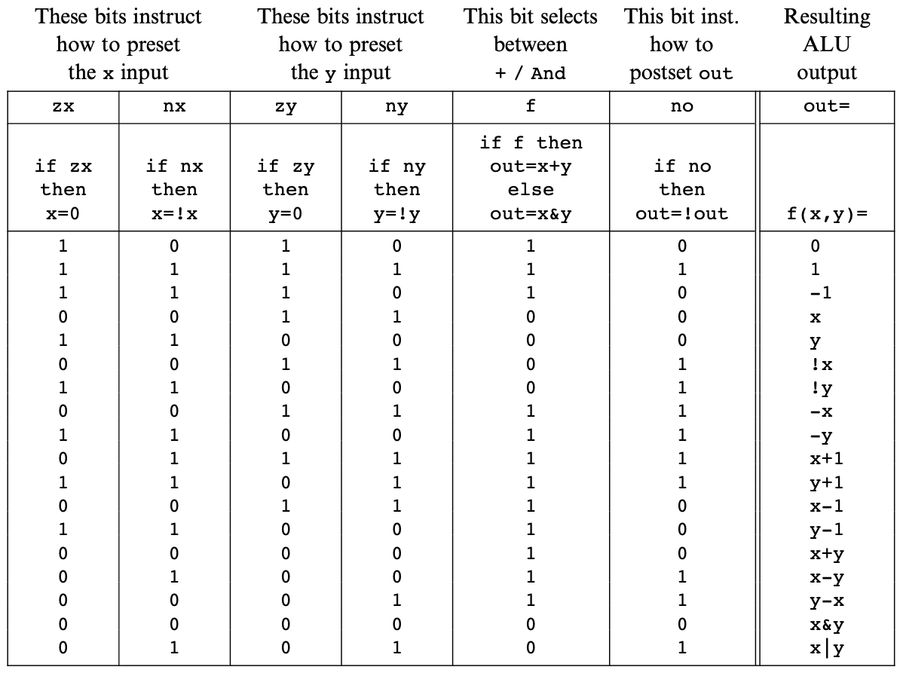

Boolean Arithmetic and the ALU
===

Addition of binary numbers
---

Representing Negative Numbers
---

- Possibility #1: Use most significant bit as `+/-` sign: not very elegant
- Possibility #2: Use 2's complement: doesn't have the problems of the above
    approach

2's complement
---

If you want to represent a negative number `-x`, you just represent it as the
positive number `2^n - x`, where `n` is the total number of bits.

Here's how that looks like in a 4-bit binary system:


The range of positive and negative numbers using this approach is:

- Positive numbers: $0\text{ to  }2^{(n-1)} - 1$
- Negative numbers: $-1\text{ to }-2^{(n-1)}$

The benefit of using 2's complement is that we get the subtraction operation for
free. For example, if we want to calculate `7 - 5`, we can represent it as `7 +
(-5)`. These numbers in their binary form (using 2's complement for `-5`) look
like:

```
  0111
+ 1011
------
  0010  (overflown bit thrown away)
```

`0010` in decimal form is `2`, which is `(7 - 5)`.

Computing -x
---

As seen above, `y - x` can be calculated using the hardware that does addition
(by representing it as `y + (-x)`), but a hardware unit is needed to compute
`-x` in 2's complement. This can be achieved using a simple mathematical trick:

$$
2^{n} - x = 1 + (2^{n} - 1) - x
$$

$(2^{n}$ is a binary number that is represented by all `1`s. To subtract any
number from a binary number with all ones, we just need to flip the bits (pretty
cool trick!). So we just flip the bits of `x` and add a `1` (using the hardware
we already have).

For example, if we need to calculate the negative of `4` (which would be `1100`
for a 4-bit system).

```
4 -> 0100

flip the bits
1011
add 1

  1011
+ 0001
------
  1100  -> exactly what we need
```

!!! tip
    Adding `1` is a special case. We start from the
    right most bit, and keep on flipping bits until we reach a `0` which is
    flipped to `1`.

!!! note
    Key takeaway: We don't need to build any special hardware to handle negative
    numbers.

The Hack ALU
---

The Hack ALU computes a fixed set of functions based on the setting of 6 input
bits, called control units.


The Hack ALU is designed to compute 18 functions, which are listed below
(although, having 6 control bits gives allows the possibility of computing `2^6` functions).



The ALU has 2 output control bits (`zr`, and `ng`), which work as follows:

- if out=0 then zr = 1 else zr = 0
- if out<0 then ng = 1 else ng = 0

Project 2
---

- [ ] HalfAdder
- [ ] FullAdder
- [ ] Add16
- [ ] Inc16
- [ ] ALU

