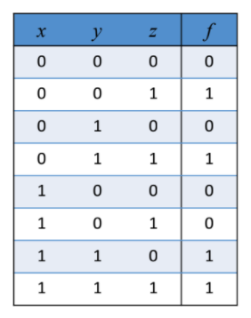
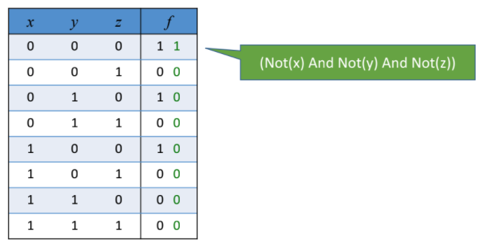
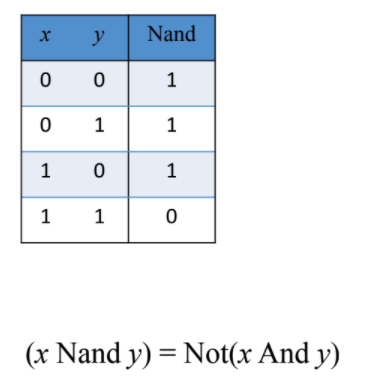
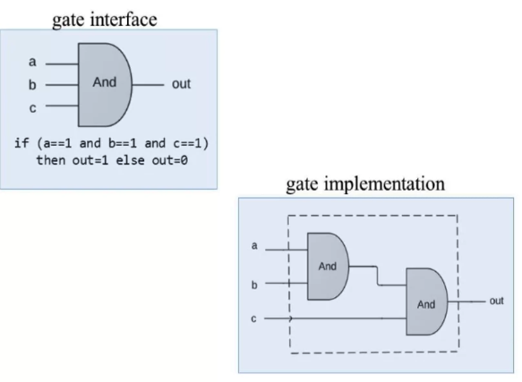
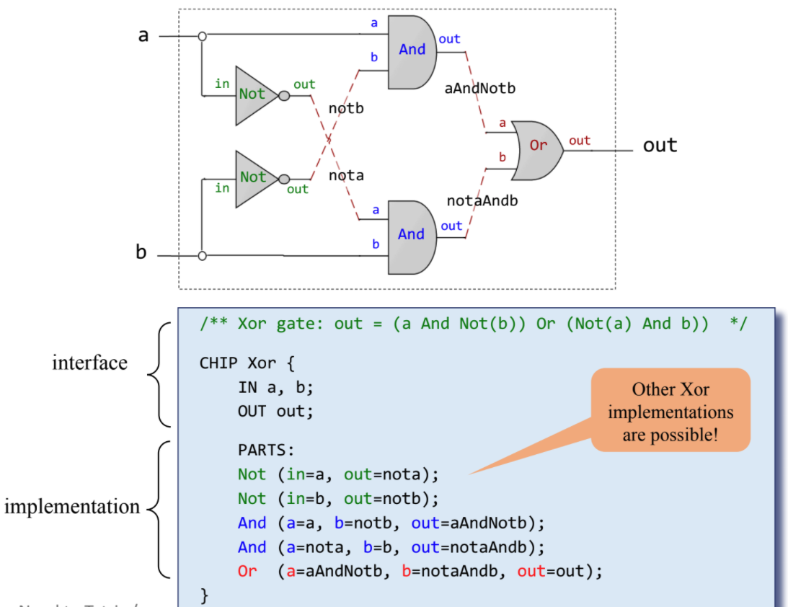

Boolean Functions and Gate Logic
===

Resources
---
- [:fontawesome-solid-link: Slides](https://drive.google.com/file/d/1MY1buFHo_Wx5DPrKhCNSA2cm5ltwFJzM/view)
- [:fontawesome-solid-link: HDL Survival Guide](https://drive.google.com/file/d/1dPj4XNby9iuAs-47U9k3xtYy9hJ-ET0T/view)

Boolean Algebra
---


Truth Table to Boolean Expression
---

Generally, we know what a certain hardware unit needs to do, and we need a boolean
expression that describes it. That is, we know the truth table of the unit, and
need a boolean expression that implements it.

We can start by constructing a 'disjunctive normal form formula' for the truth
table. For example, if we want the boolean expression for the following table:



we'll go through the table row by row, and for every row with an output of 1,
write an expression that results in a 1 just for this row. That is, for the
first row, we get:



We'll write expressions for each of the rows with output 1, and `OR` them all.

Finally, we'll end up with an expression like this:


This expression can be simplified further using boolean algebra.

Basic Building Block
---

As we can see above, any boolean function can be represented using an
expression containing AND, OR, and NOT operations. But, we don't really need
`OR`, as it can be constructed with `AND`, and `NOT` operations:

```
(x OR y) = NOT(NOT(x) AND NOT(y))
```

!!! info "Key takeaway"
    Every boolean expression can be represented with `AND` and `NOT`
    operations.

This leads us to think about the following question:

!!! note "Question"
    Is there a operation that can be used as a building block for any
    boolean expression?

The answer to the question is the `NAND` operation.

NAND
---



The `NAND` operation can be used to build `NOT` and `AND` as follows:

```
NOT(x)    = (x NAND x)
(x AND y) = NOT(x NAND y)
```

Logic Gates
---

A gate has an interface and an implementation.

- Interface: **WHAT** is the gate supposed to do?
- Implementation: **HOW** is the gate doing it?



Hardware Description Language
---



Project 1
---

Given NAND:

Build the following gates:

 - [ ] Elementary
     - [x] Not
     - [x] And
     - [x] Or
     - [x] Xor
     - [ ] Mux
     - [ ] DMux
 - [ ] 16 bit variants
     - [ ] Not16
     - [ ] And16
     - [ ] Or16
     - [ ] Mux16
 - [ ] Multi-way variants
     - [ ] Or8Way
     - [ ] Mux4Way16
     - [ ] Mux8Way16
     - [ ] DMux4Way
     - [ ] DMux8Way

Xor
---

```
(x OR y) = NOT(NOT(x) AND NOT(y))
```

```vhdl
CHIP Xor {
    IN a, b;
    OUT out;

    PARTS:
    Not (in=a, out=nota);
    Not (in=b, out=notb);
    And (a=a, b=notb, out=x);
    And (a=nota, b=b, out=y);
    Or (a=x, b=y, out=out);
}
```
