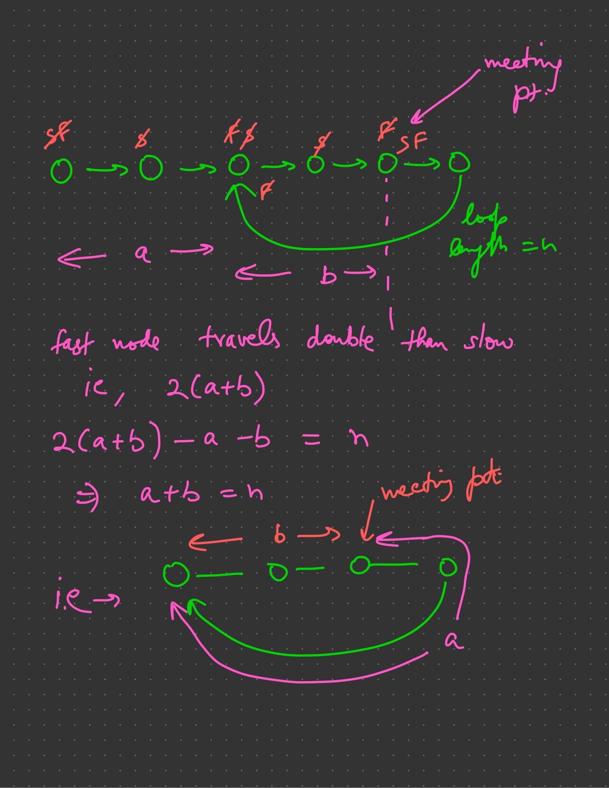

142: Linked List Cycle 2
===

Cleverly builds upon the problem of simply detecting if a loop exists or not.

If we start two pointers at `head` and `meetingPoint`, they'll meet after `a`
iterations, and that's the node where the cycle begins.
