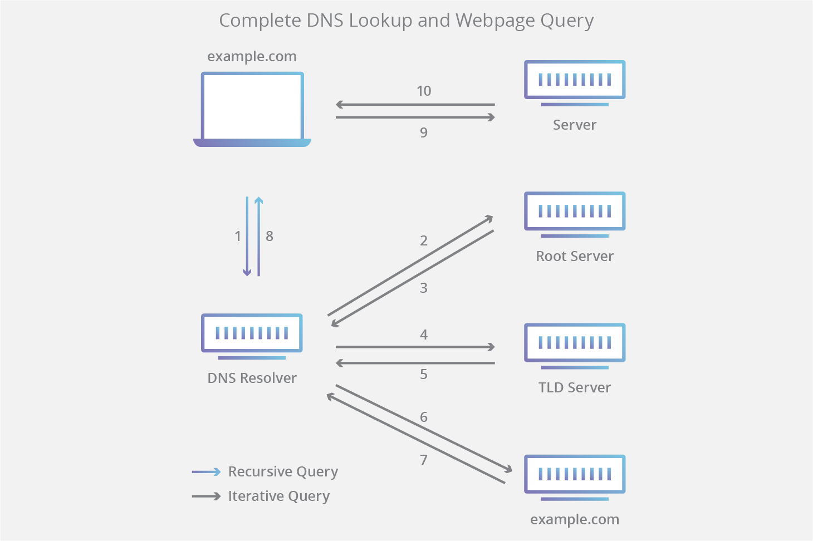

# DNS Lookup

Resources
---

- [What is DNS? | How DNS works | Cloudflare][1]
- [Browser DNS lookup][2]

<!-- Links -->
[1]: https://www.cloudflare.com/en-gb/learning/dns/what-is-dns/
[2]: chrome://net-internals/#dns

<!-- Links end -->

Steps in a DNS lookup
---

From [here][1]:

1) A user types ‘example.com’ into a web browser and the query travels into the
Internet and is received by a DNS recursive resolver.
2) The resolver then queries a DNS root nameserver (.).
3) The root server then responds to the resolver with the address of a Top Level
Domain (TLD) DNS server (such as .com or .net), which stores the information for
its domains. When searching for example.com, our request is pointed toward the
.com TLD.
4) The resolver then makes a request to the .com TLD.
5) The TLD server then responds with the IP address of the domain’s nameserver,
example.com.
6) Lastly, the recursive resolver sends a query to the domain’s nameserver.
7) The IP address for example.com is then returned to the resolver from the
nameserver.
8) The DNS resolver then responds to the web browser with the IP address of the
domain requested initially.

Once the 8 steps of the DNS lookup have returned the IP address for example.com,
the browser is able to make the request for the web page:

9) The browser makes a HTTP request to the IP address.
10) The server at that IP returns the webpage to be rendered in the browser.

