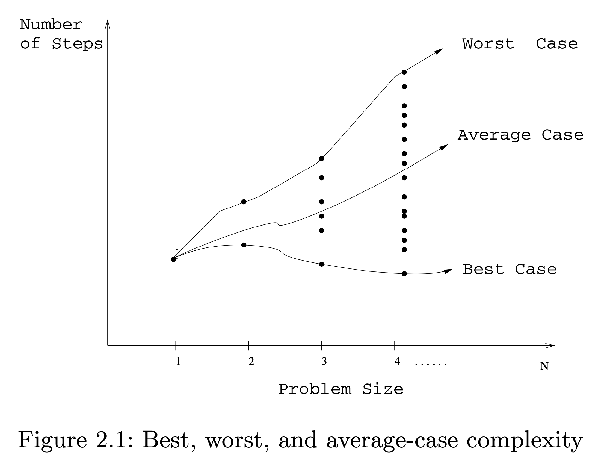

# 2.1: The RAM Model of Computation

To understand the notions of the best, worst, and average-case complexity, think
about running an algorithm over all possible instances of data that can be fed
to it.

For the problem of sorting, the set of possible input instances consists of all
possible arrangements of n keys, over all possible values of n. We can represent
each input instance as a point on a graph where the x-axis represents the size
of the input problem (for sorting, the number of items to sort), and the y-axis
denotes the number of steps taken by the algorithm in this instance. These
points naturally align themselves into columns, because only integers represent
possible input size (e.g., it makes no sense to sort 10.57 items).

We can define three interesting functions over the plot of these points:

- The worst-case complexity of the algorithm is the function defined by the
maximum number of steps taken in any instance of size n. This represents the
curve passing through the highest point in each column.
- The best-case complexity of the algorithm is the function defined by the minimum
number of steps taken in any instance of size n. This represents the curve
passing through the lowest point of each column.
- The average-case complexity of the algorithm, which is the function defined by
the average number of steps over all instances of size n.

