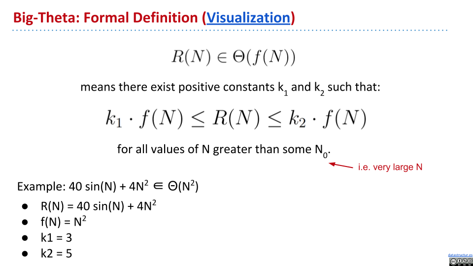
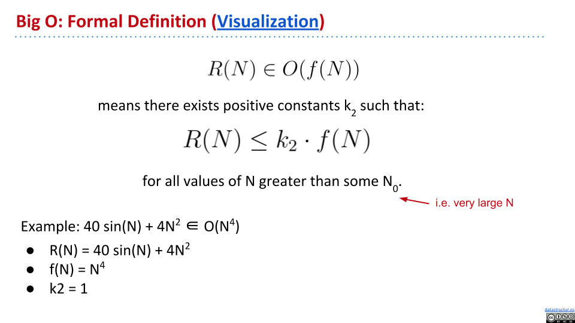
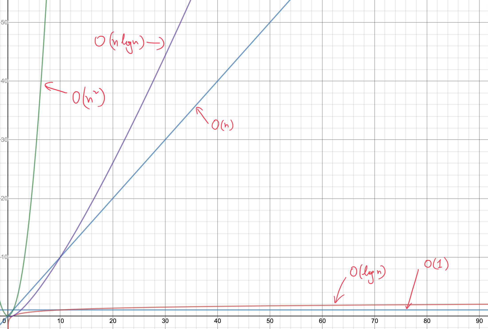
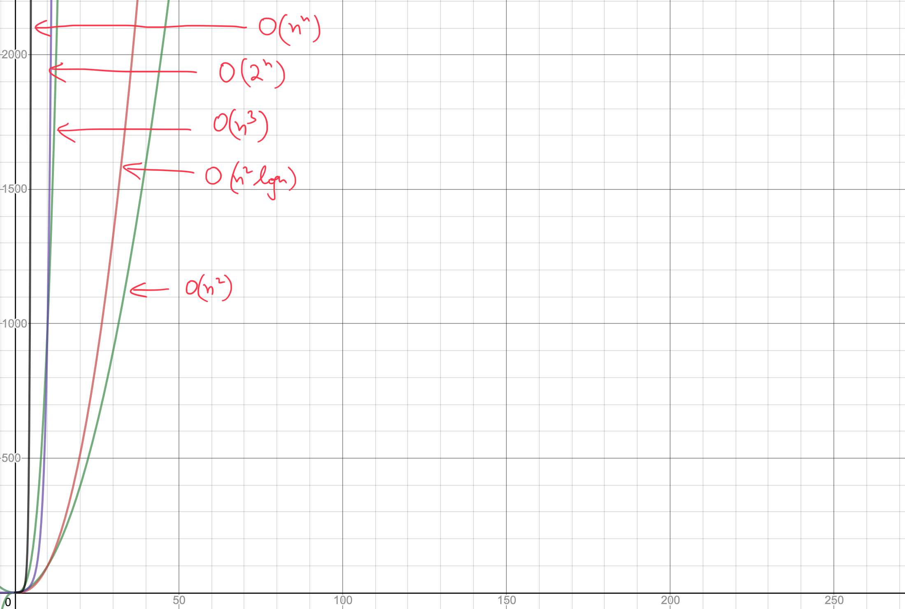

# Asymptotics

Big Theta
---

!!! note "Big Theta -> order of growth"

Big O
---

!!! note "Big Theta can be thought of something like "equal to", Big O can be thought of as "less than or equal to"."

For formal definition, we just remove the left hand side from Big Theta.

Increasing Order
---

