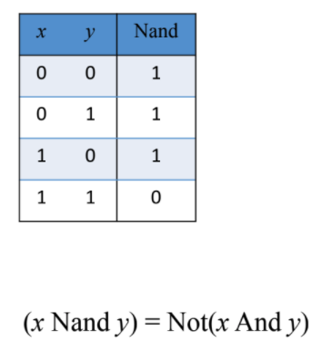

# Boolean Functions and Gate Logic

Resources
---
- [Slides](https://drive.google.com/file/d/1MY1buFHo_Wx5DPrKhCNSA2cm5ltwFJzM/view)
- [HDL Survival Guide](https://drive.google.com/file/d/1dPj4XNby9iuAs-47U9k3xtYy9hJ-ET0T/view)

Boolean Algebra
---


Truth Table to Boolean Expression
---

Generally, we know what a certain hardware unit needs to do, and we need a boolean
expression that describes it. That is, we know the truth table of the unit, and
need a boolean expression that implements it.

We can start by constructing a 'disjunctive normal form formula' for the truth
table. For example, if we want the boolean expression for the following table:


we'll go through the table row by row, and for every row with an output of 1,
write an expression that results in a 1 just for this row. That is, for the
first row, we get:


We'll write expressions for each of the rows with output 1, and `OR` them all.

Finally, we'll end up with an expression like this:


This expression can be simplified further using boolean algebra.

Basic Building Block
---

As we can see above, any boolean function can be represented using an
expression containing AND, OR, and NOT operations. But, we don't really need
`OR`, as it can be constructed with `AND`, and `NOT` operations:

```
(x OR y) = NOT(NOT(x) AND NOT(y))
```

!!! info "Key takeaway"
    Every boolean expression can be represented with `AND` and `NOT`
    operations.

This leads us to think about the following question:

!!! note "Question"
    Is there a operation that can be used as a building block for any
    boolean expression?

The answer to the question is the `NAND` operation.

NAND
---



The `NAND` operation can be used to build `NOT` and `AND` as follows:

```
NOT(x)    = (x NAND x)
(x AND y) = NOT(x NAND y)
```

Logic Gates
---

A gate has an interface and an implementation.

- Interface: **WHAT** is the gate supposed to do?
- Implementation: **HOW** is the gate doing it?


Hardware Description Language
---


Project 1
---

Given NAND:

Build the following gates:

 - [x] Elementary
     - [x] Not
     - [x] And
     - [x] Or
     - [x] Xor
     - [x] Mux
     - [x] DMux
 - [x] 16 bit variants
     - [x] Not16
     - [x] And16
     - [x] Or16
     - [x] Mux16
 - [x] Multi-way variants
     - [x] Or8Way
     - [x] Mux4Way16
     - [x] Mux8Way16
     - [x] DMux4Way
     - [x] DMux8Way

Xor
---

```
(x OR y) = NOT(NOT(x) AND NOT(y))
```

```vhdl
CHIP Xor {
    IN a, b;
    OUT out;

    PARTS:
    Not (in=a, out=nota);
    Not (in=b, out=notb);
    And (a=a, b=notb, out=x);
    And (a=nota, b=b, out=y);
    Or (a=x, b=y, out=out);
}
```

Mux
---

A multiplexor is a three-input gate that uses one of the inputs, called
‘selection bit,’ to select and output one of the other two inputs, called ‘data
bits.’ The name multiplexor was adopted from communications systems, where
similar devices are used to serialize (multiplex) several input signals over a
single output wire.

![ [Image] ](assets/mux.png)

A mux can be represented as:

```
(a AND NOT sel) OR  (b AND sel)
```

```vhdl
CHIP Mux {
    IN a, b, sel;
    OUT out;

    PARTS:
    Not(in=sel, out=notSel);
    And(a=a, b=notSel, out=aAndNotSel);
    And(a=b, b=sel, out=bAndSel);
    Or(a=aAndNotSel, b=bAndSel, out=out);
}
```

DMux
---

A demultiplexor performs the opposite function of a multiplexor: It takes a
single input and channels it to one of two possible outputs according to a
selector bit that specifies which output to chose.


a and b can be represented as:

```
a = in AND NOT sel
b = in AND sel
```

```vhdl
CHIP DMux {
    IN in, sel;
    OUT a, b;

    PARTS:
    Not(in=sel, out=notSel);
    And(a=in, b=notSel, out=a);
    And(a=in, b=sel, out=b);
}
```
Mux16
---

```vhdl
CHIP Mux16 {
    IN a[16], b[16], sel;
    OUT out[16];

    PARTS:
    Mux(a=a[0], b=b[0], sel=sel, out=out[0]);
    Mux(a=a[1], b=b[1], sel=sel, out=out[1]);
    Mux(a=a[2], b=b[2], sel=sel, out=out[2]);
    Mux(a=a[3], b=b[3], sel=sel, out=out[3]);
    Mux(a=a[4], b=b[4], sel=sel, out=out[4]);
    Mux(a=a[5], b=b[5], sel=sel, out=out[5]);
    Mux(a=a[6], b=b[6], sel=sel, out=out[6]);
    Mux(a=a[7], b=b[7], sel=sel, out=out[7]);
    Mux(a=a[8], b=b[8], sel=sel, out=out[8]);
    Mux(a=a[9], b=b[9], sel=sel, out=out[9]);
    Mux(a=a[10], b=b[10], sel=sel, out=out[10]);
    Mux(a=a[11], b=b[11], sel=sel, out=out[11]);
    Mux(a=a[12], b=b[12], sel=sel, out=out[12]);
    Mux(a=a[13], b=b[13], sel=sel, out=out[13]);
    Mux(a=a[14], b=b[14], sel=sel, out=out[14]);
    Mux(a=a[15], b=b[15], sel=sel, out=out[15]);
```

Mux4Way16
---


```
Chip name: Mux4Way16
Inputs:    a[16], b[16], c[16], d[16], sel[2]
Outputs:   out[16]
Function:  If sel=00 then out=a else if sel=01 then out=b else if sel=10 then
out=c else if sel=11 then out=d
Comment:   The assignment operations mentioned
above are all 16-bit. For example, "out=a" means "for i=0..15 out[i]=a[i]".
```

```vhdl
CHIP Mux4Way16 {
    IN a[16], b[16], c[16], d[16], sel[2];
    OUT out[16];

    PARTS:
    Mux16(a=a, b=b, sel=sel[0], out=Mux1Out);
    Mux16(a=c, b=d, sel=sel[0], out=Mux2Out);
    Mux16(a=Mux1Out, b=Mux2Out, sel=sel[1], out=out);
}
```

Mux8Way16
---

```vhdl
CHIP Mux8Way16 {
    IN a[16], b[16], c[16], d[16],
       e[16], f[16], g[16], h[16],
       sel[3];
    OUT out[16];

    PARTS:
    Mux16(a=a, b=b, sel=sel[0], out=Mux1Out);
    Mux16(a=c, b=d, sel=sel[0], out=Mux2Out);
    Mux16(a=e, b=f, sel=sel[0], out=Mux3Out);
    Mux16(a=g, b=h, sel=sel[0], out=Mux4Out);
    Mux4Way16(a=Mux1Out, b=Mux2Out, c=Mux3Out, d=Mux4Out, sel=sel[1..2],
    out=out);
}
```

Dmux4Way
---


```
Chip name: DMux4Way
Inputs:    in, sel[2]
Outputs:   a, b, c, d
Function:  If sel=00 then {a=in, b=c=d=0}
else if sel=01 then {b=in, a=c=d=0}
else if sel=10 then {c=in, a=b=d=0}
else if sel=11 then {d=in, a=b=c=0}.
```

```vhdl
CHIP DMux4Way {
    IN in, sel[2];
    OUT a, b, c, d;

    PARTS:
    DMux(in=in, sel=sel[0], a=Dmux1A, b=Dmux1B);
    DMux(in=in, sel=sel[0], a=Dmux1C, b=Dmux1D);
    Not(in=sel[1], out=notSel1);
    And(a=Dmux1A, b=notSel1, out=a);
    And(a=Dmux1B, b=notSel1, out=b);
    And(a=Dmux1C, b=sel[1], out=c);
    And(a=Dmux1D, b=sel[1], out=d);
}
```

DMux8Way
---


```vhdl
CHIP DMux8Way {
    IN in, sel[3];
    OUT a, b, c, d, e, f, g, h;

    PARTS:
    Not(in=sel[2], out=notSel2);
    DMux4Way(in=in, sel=sel[0..1], a=aInt, b=bInt, c=cInt, d=dInt);
    DMux4Way(in=in, sel=sel[0..1], a=eInt, b=fInt, c=gInt, d=hInt);
    And(a=aInt, b=notSel2, out=a);
    And(a=bInt, b=notSel2, out=b);
    And(a=cInt, b=notSel2, out=c);
    And(a=dInt, b=notSel2, out=d);
    And(a=eInt, b=sel[2], out=e);
    And(a=fInt, b=sel[2], out=f);
    And(a=gInt, b=sel[2], out=g);
    And(a=hInt, b=sel[2], out=h);
}
```
