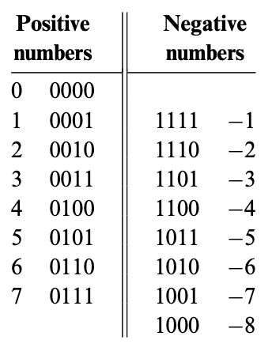
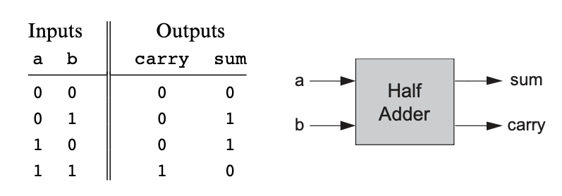
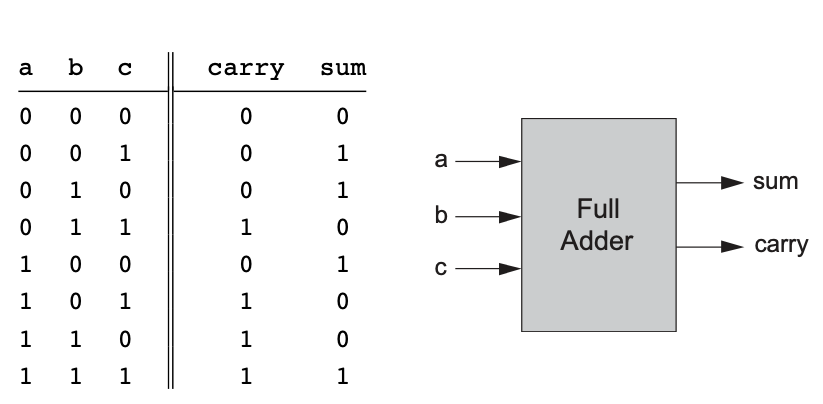
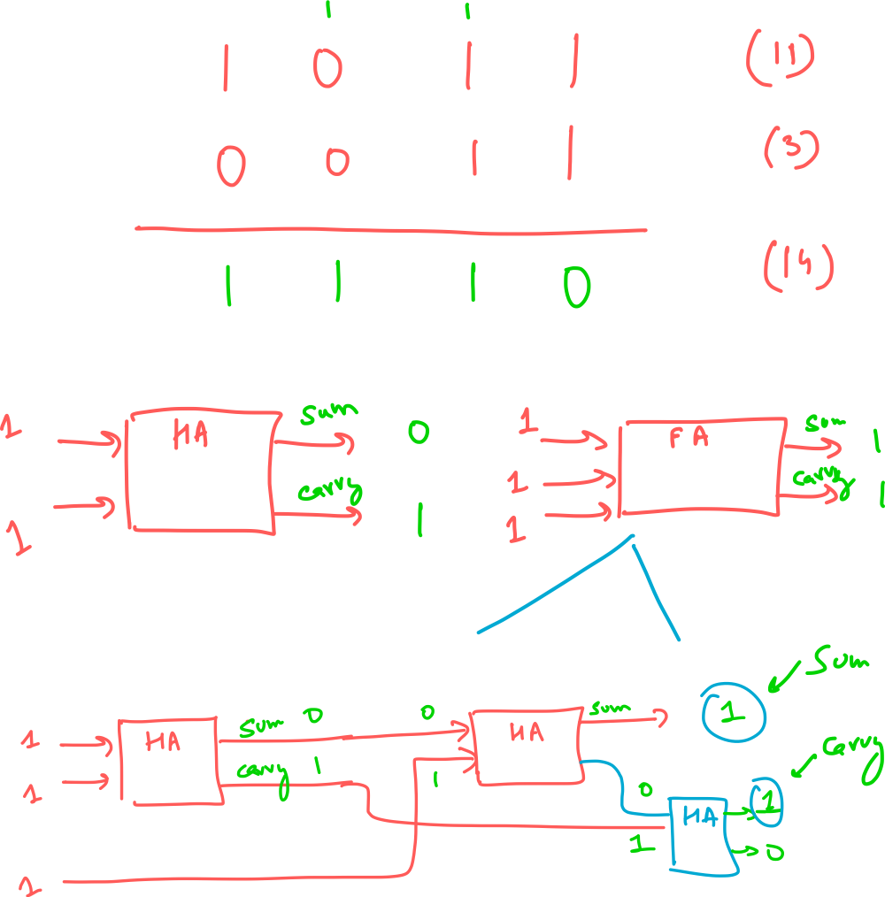
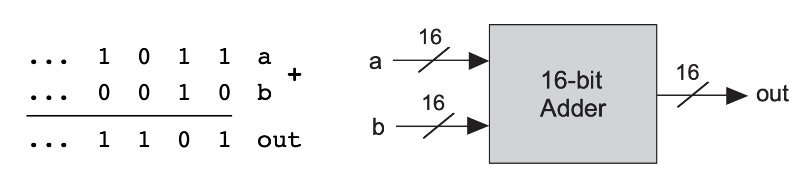
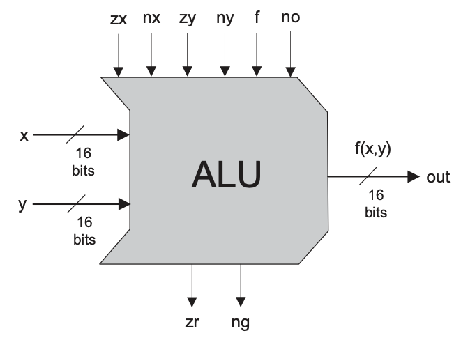
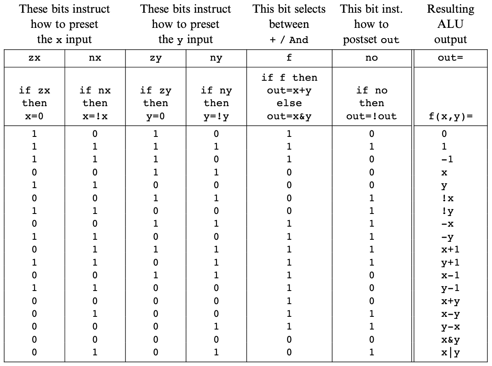

# Boolean Arithmetic and the ALU

Representing Negative Numbers
---

- Possibility #1: Use most significant bit as `+/-` sign: not very elegant
- Possibility #2: Use 2's complement: doesn't have the problems of the above
    approach

2's complement
---

If you want to represent a negative number `-x`, you just represent it as the
positive number `2^n - x`, where `n` is the total number of bits.

Here's how that looks like in a 4-bit binary system:



The range of positive and negative numbers using this approach is:

- Positive numbers: $0\text{ to  }2^{(n-1)} - 1$
- Negative numbers: $-1\text{ to }-2^{(n-1)}$

The benefit of using 2's complement is that we get the subtraction operation for
free. For example, if we want to calculate `7 - 5`, we can represent it as `7 +
(-5)`. These numbers in their binary form (using 2's complement for `-5`) look
like:

```
  0111
+ 1011
------
  0010  (overflown bit thrown away)
```

`0010` in decimal form is `2`, which is `(7 - 5)`.

Computing -x
---

As seen above, `y - x` can be calculated using the hardware that does addition
(by representing it as `y + (-x)`), but a hardware unit is needed to compute
`-x` in 2's complement. This can be achieved using a simple mathematical trick:

$$
2^{n} - x = 1 + (2^{n} - 1) - x
$$

$(2^{n}$ is a binary number that is represented by all `1`s. To subtract any
number from a binary number with all ones, we just need to flip the bits (pretty
cool trick!). So we just flip the bits of `x` and add a `1` (using the hardware
we already have).

For example, if we need to calculate the negative of `4` (which would be `1100`
for a 4-bit system).

```
4 -> 0100

flip the bits
1011
add 1

  1011
+ 0001
------
  1100  -> exactly what we need
```

!!! tip
    Adding `1` is a special case. We start from the
    right most bit, and keep on flipping bits until we reach a `0` which is
    flipped to `1`.

!!! note
    Key takeaway: We don't need to build any special hardware to handle negative
    numbers.

Project 2
---

- [x] HalfAdder
- [x] FullAdder
- [x] Add16
- [x] Inc16
- [x] ALU

HalfAdder
---



The carry column resembles an `AND` gate, and the sum column resembles an `XOR`
gate.

```vhdl
CHIP HalfAdder {
    IN a, b;    // 1-bit inputs
    OUT sum,    // Right bit of a + b 
        carry;  // Left bit of a + b

    PARTS:
    And(a=a, b=b, out=carry);
    Xor(a=a, b=b, out=sum);
}
```


FullAdder
---





The third HalfAdder is not needed, since we're only considering the `sum` output
of the HalfAdder anyway, which follows the `XOR` logic.

```vhdl
CHIP FullAdder {
    IN a, b, c;  // 1-bit inputs
    OUT sum,     // Right bit of a + b + c
        carry;   // Left bit of a + b + c

    PARTS:
    HalfAdder(a=a, b=b, sum=intSum, carry=intCarry1);
    HalfAdder(a=intSum, b=c, sum=sum, carry=intCarry2);
    Xor(a=intCarry1, b=intCarry2, out=carry);
}
```

Adder16
---



```vhdl
CHIP Add16 {
    IN a[16], b[16];
    OUT out[16];

    PARTS:
    HalfAdder(a=a[0], b=b[0], sum=out[0], carry=carry1);
    FullAdder(a=a[1], b=b[1], c=carry1, sum=out[1], carry=carry2);
    FullAdder(a=a[2], b=b[2], c=carry2, sum=out[2], carry=carry3);
    FullAdder(a=a[3], b=b[3], c=carry3, sum=out[3], carry=carry4);
    FullAdder(a=a[4], b=b[4], c=carry4, sum=out[4], carry=carry5);
    FullAdder(a=a[5], b=b[5], c=carry5, sum=out[5], carry=carry6);
    FullAdder(a=a[6], b=b[6], c=carry6, sum=out[6], carry=carry7);
    FullAdder(a=a[7], b=b[7], c=carry7, sum=out[7], carry=carry8);
    FullAdder(a=a[8], b=b[8], c=carry8, sum=out[8], carry=carry9);
    FullAdder(a=a[9], b=b[9], c=carry9, sum=out[9], carry=carry10);
    FullAdder(a=a[10], b=b[10], c=carry10, sum=out[10], carry=carry11);
    FullAdder(a=a[11], b=b[11], c=carry11, sum=out[11], carry=carry12);
    FullAdder(a=a[12], b=b[12], c=carry12, sum=out[12], carry=carry13);
    FullAdder(a=a[13], b=b[13], c=carry13, sum=out[13], carry=carry14);
    FullAdder(a=a[14], b=b[14], c=carry14, sum=out[14], carry=carry15);
    FullAdder(a=a[15], b=b[15], c=carry15, sum=out[15], carry=carry16);
}
```

ALU
---

The Hack ALU computes a fixed set of functions based on the setting of 6 input
bits, called control units.



The Hack ALU is designed to compute 18 functions, which are listed below
(although, having 6 control bits gives allows the possibility of computing `2^6` functions).



The ALU has 2 output control bits (`zr`, and `ng`), which work as follows:

- if out=0 then zr = 1 else zr = 0
- if out<0 then ng = 1 else ng = 0


```vhdl
CHIP ALU {
    IN  
        x[16], y[16],  // 16-bit inputs        
        zx, // zero the x input?
        nx, // negate the x input?
        zy, // zero the y input?
        ny, // negate the y input?
        f,  // compute out = x + y (if 1) or x & y (if 0)
        no; // negate the out output?

    OUT 
        out[16], // 16-bit output
        zr, // 1 if (out == 0), 0 otherwise
        ng; // 1 if (out < 0),  0 otherwise

    PARTS:
    Mux16(a=x, b=false, sel=zx, out=stage1OutX);
    Not16(in=stage1OutX, out=notStage1OutX);
    Mux16(a=stage1OutX, b=notStage1OutX, sel=nx, out=stage2OutX);

    Mux16(a=y, b=false, sel=zy, out=stage1OutY);
    Not16(in=stage1OutY, out=notStage1OutY);
    Mux16(a=stage1OutY, b=notStage1OutY, sel=ny, out=stage2OutY);
    
    Add16(a=stage2OutX, b=stage2OutY, out=xPlusY);
    And16(a=stage2OutX, b=stage2OutY, out=xBitwiseAndY);
    Mux16(a=xBitwiseAndY, b=xPlusY, sel=f, out=stage3Out);

    Not16(in=stage3Out, out=notStage3Out);
    Mux16(a=stage3Out, b=notStage3Out, sel=no, out=out, out[0..7]=zout1, out[8..15]=zout2, out[15]=ng);
    //pretty neat! -> output can be fanned out to multiple signals
    //in a single line

    Or8Way(in=zout1, out=or1);
    Or8Way(in=zout2, out=or2);
    Or(a=or1, b=or2, out=orOut);
    //the above 3 lines are to check if all bits in out are 0
    Not(in=orOut, out=zr);
}
```
