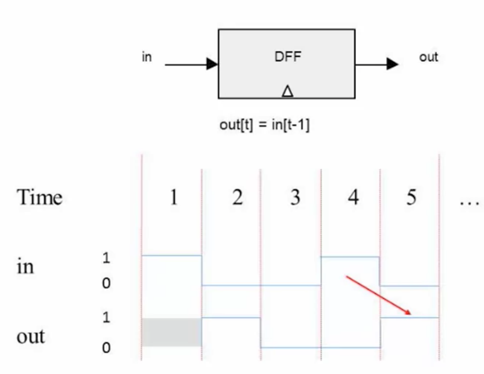
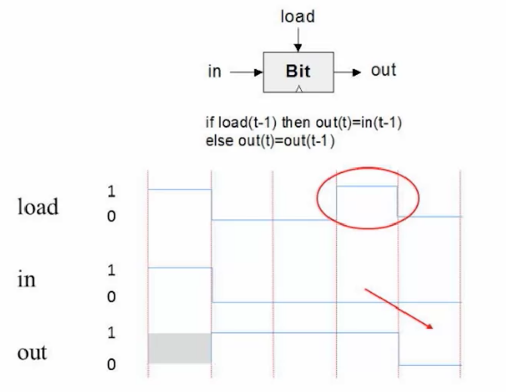

# Memory

Data-Flip-Flop
---

A DFF gate has a single-bit input and a single-bit output.



```
out(t) = in(t-1)
```

Project 3
---

- [ ] Bit
- [ ] Register
- [ ] RAM8
- [ ] RAM64
- [ ] RAM512
- [ ] RAM4k
- [ ] RAM16K
- [ ] PC


1-bit Register
---


