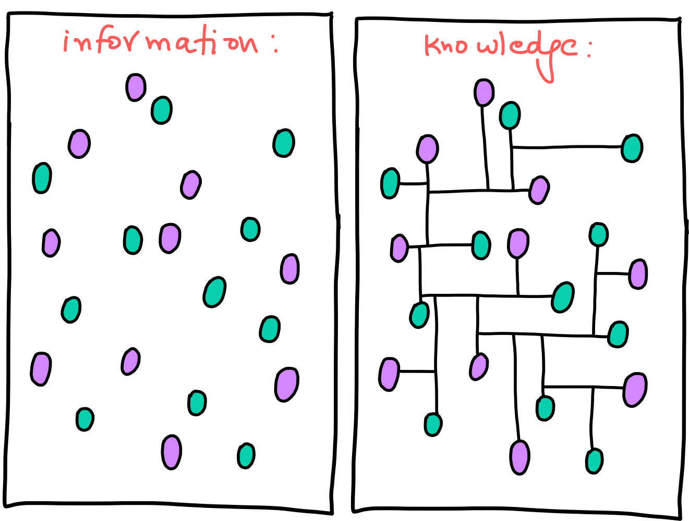

Dhruv's Wiki
===

My long-term goal for this wiki is to consolidate all — or atleast most! — of what I know.

Why does this exist?
---

I've been writing reasonably well maintained notes on Notion for a while now. Even though it's one of the best note taking tools out there, I didn't want to be tied down to a specific platform for my wiki. On top of that, the lack of Vim — which I recently picked up — key bindings in Notion expedited the switch to simple markdown based notes.

The following infographic sums up my reasoning behind creating a wiki like this.

*[:fontawesome-solid-link: Source](https://www.gapingvoid.com/blog/2014/01/22/information-vs-knowledge/)*

> This wiki is still in *"construction mode"*, as there's a lot of stuff I need to port over from Notion.

Modules
---

- [:fontawesome-solid-archive: Computer Science](./computer-science/index.md)
- [:fontawesome-solid-archive: Programming](./programming/index.md)
- [:fontawesome-solid-archive: Tools](./tools/index.md)
- [:fontawesome-solid-archive: Books](books/index.md)
- [:fontawesome-solid-archive: Other](other/index.md)
