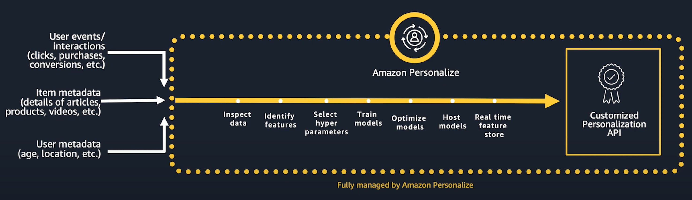
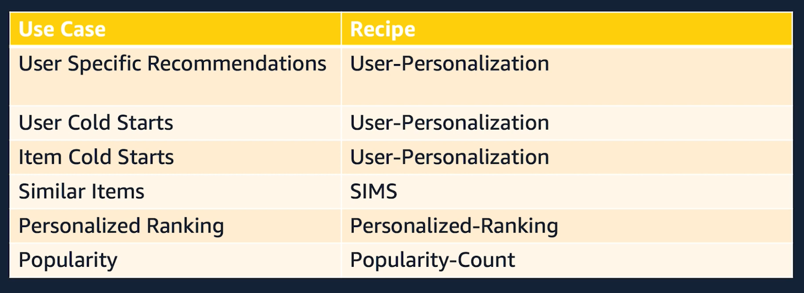
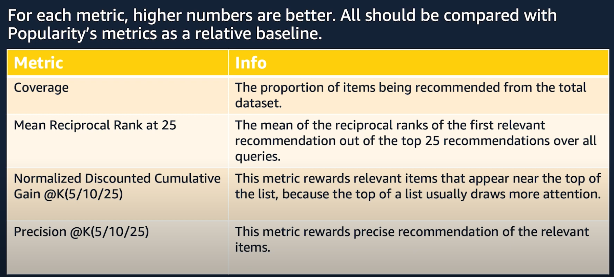

AWS Personalize
===

Resources
---

- [Introduction to Amazon Personalize][1]
- [Amazon Personalize Resources][2]

<!-- Links -->
[1]: https://www.youtube.com/watch?v=3gJmhoLaLIo
[2]: https://aws.amazon.com/personalize/resources/

Basics
---

Use Cases
---

- **Similar Items**: Recommending items not based on item metadata, but based on how users are buying items.

Solution Metrics
---

