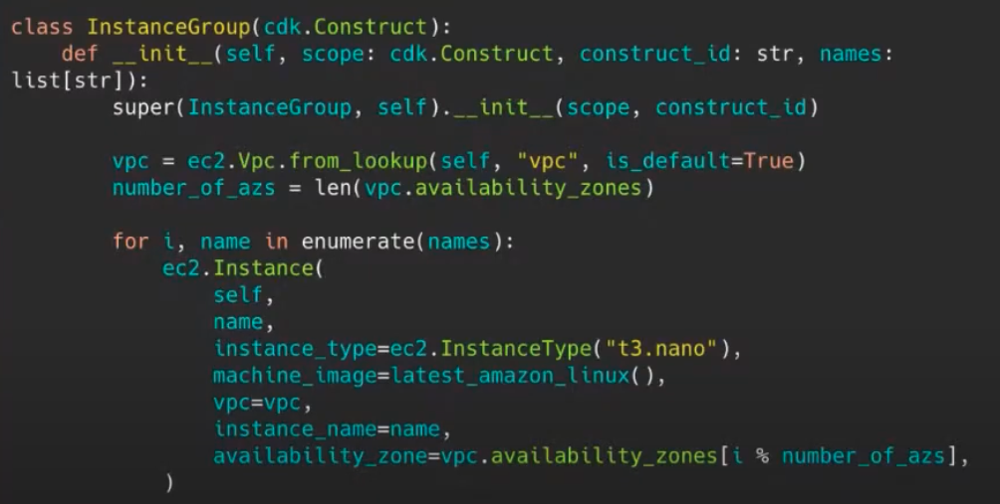
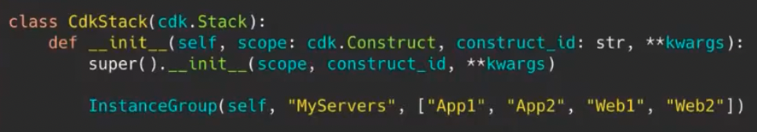

April 2021 Mistakes I made writing IAC
===

Resources
---

- [:fontawesome-solid-play-circle: April 2021 - Mistakes I made writing
    Infrastructure as Code, Ben Bridts][1]

<!-- Links -->
[1]: https://www.youtube.com/watch?v=1gxArqL_Eg4

Properties based on language control flow
---

If a property (like availablity zone) is based on a for loop, it is likely to
change if the order of the loop is changed.

If the list is changed, the availablity zones will also change, leading to
creation of new AWS resources (as opposed to updating in place).
