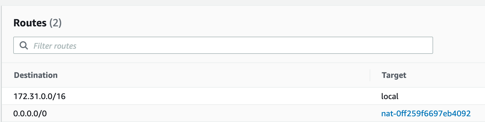

Add private subnets to existing VPC
===

Resources
---

- [AWS ECS Fargate ResourceInitializationError: unable to pull secrets or registry auth][1]

<!-- Links -->
[1]: https://stackoverflow.com/questions/61265108/aws-ecs-fargate-resourceinitializationerror-unable-to-pull-secrets-or-registry

Setup
---

### Usecase

You need to run Fargate service(s) in private subnets, but they don't
exist yet. The containers (running on ECS) need to be able to make outgoing
network calls.

Let's say the CIDR of the VPC is `172.31.0.0/16`. More about CIDRs here: [[cidr]]

### Solution

First of all, the private subnet(s) need NAT gateway(s) to forward network
traffic to the VPC's Internet Gateway. Create a public subnet in the VPC if it
doesn't already exist, and then create a NAT gateway in this subnet.

Let's say the CIDR of the public subnet is `172.31.0.0/20`.

Then, create a private subnet in the VPC.

Let's say the CIDR of the private subnet is `172.31.48.0/20`.

Once created, its route table will need to be modified (or maybe a new route
table will have to be created). The primary thing to note is that this route
table needs to have a route where the destination of `0.0.0.0/0` points to the
target of the NAT gateway created before. This means that all network packets
that are intended for the public internet will be sent to the NAT gateway, which
will then forward them to the Internet Gateway (for that VPC).

Once all of this is set up, the ECS containers in the private subnet will be
able to make outgoing calls to the public internet.

[//begin]: # "Autogenerated link references for markdown compatibility"
[cidr]: ../../../computer-science/computer-networking/wiki/cidr.md "CIDR"
[//end]: # "Autogenerated link references"