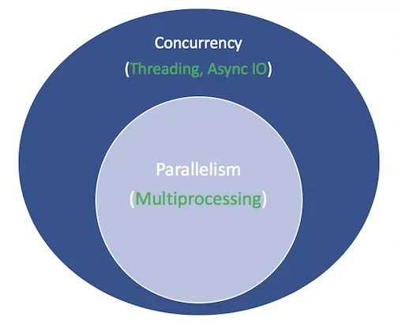

# Asyncio

## Resources

- [:fontawesome-solid-link: Async IO in Python: A Complete Walkthrough - Real Python](https://realpython.com/async-io-python/)

- [:fontawesome-solid-link: Speed Up Your Python Program With Concurrency - Real Python](https://realpython.com/python-concurrency/)

- [:fontawesome-solid-link: Miguel Grinberg Asynchronous Python for the Complete Beginner PyCon 2017](https://www.youtube.com/watch?v=iG6fr81xHKA&feature=youtu.be&t=4m29s)

- [:fontawesome-solid-link: Concurrency and async / await](https://fastapi.tiangolo.com/async/#in-a-hurry)

## Intro

**Parallelism** consists of performing multiple operations at the same time. **Multiprocessing** is a means to effect parallelism, and it entails spreading tasks over a computer’s central processing units (CPUs, or cores). Multiprocessing is well-suited for CPU-bound tasks: tightly bound `for` loops and mathematical computations usually fall into this category.

**Concurrency** is a slightly broader term than parallelism. It suggests that multiple tasks have the ability to run in an overlapping manner. (There’s a saying that concurrency does not imply parallelism.)

**Threading** is a concurrent execution model whereby multiple [:fontawesome-solid-link: threads](https://en.wikipedia.org/wiki/Thread_(computing)) take turns executing tasks. One process can contain multiple threads. Python has a complicated relationship with threading thanks to its [:fontawesome-solid-link: GIL](https://realpython.com/python-gil/), but that’s beyond the scope of this article.

What’s important to know about threading is that it’s better for IO-bound tasks. While a CPU-bound task is characterized by the computer’s cores continually working hard from start to finish, an IO-bound job is dominated by a lot of waiting on input/output to complete.

Concurrency encompasses both multiprocessing (ideal for CPU-bound tasks) and threading (suited for IO-bound tasks). Multiprocessing is a form of parallelism, with parallelism being a specific type (subset) of concurrency.

The white terms represent concepts, and the green terms represent ways in which they are implemented or effected:



```python
# asynchronous
import asyncio

async def count():
    print("One")
    await asyncio.sleep(1)
    print("Two")

async def main():
    await asyncio.gather(count(), count(), count())

if __name__ == "__main__":
    import time
    s = time.perf_counter()
    asyncio.run(main())
    elapsed = time.perf_counter() - s
    print(f"{__file__} executed in {elapsed:0.2f} seconds.")

"""
One
One
One
Two
Two
Two
countasync.py executed in 1.01 seconds.
"""
```

```python
# synchronous
import time

def count():
    print("One")
    time.sleep(1)
    print("Two")

def main():
    for _ in range(3):
        count()

if __name__ == "__main__":
    s = time.perf_counter()
    main()
    elapsed = time.perf_counter() - s
    print(f"{__file__} executed in {elapsed:0.2f} seconds.")

"""
One
Two
One
Two
One
Two
countsync.py executed in 3.01 seconds.
"""

```
