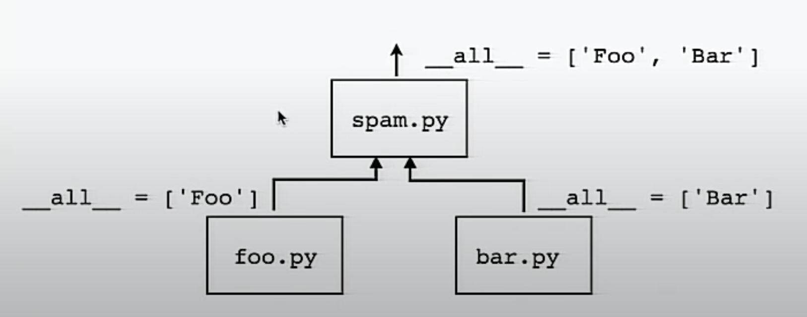

Python Controlling Exports
===

Following is from David Beazley's talk.

Each submodule in a package can define `__all__`.

```python
# spam/foo.py

__all__ = [ 'Foo' ]

class Foo:
    ...
```

```python
# spam/bar.py

__all__ = [ 'Bar' ]

class Bar:
    ...
```

```python
# spam/__init__.py

from .foo import Foo
from .bar import Bar

__all__ = (foo.__all__ + bar.__all__)
```



This is used in the standard library (eg. in `asyncio`)
