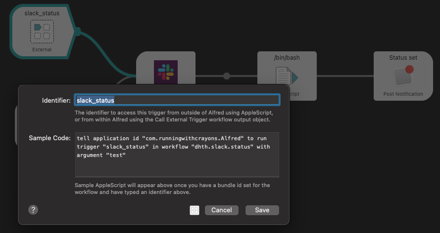

Templates
===

Keyboard Maestro Template
---

```edn
:templates {
         :km "osascript -e 'tell application \"Keyboard Maestro Engine\" to do script \"%s\"'"
         }
```

Use it as:

```
[:k [:km "open: nikitas karabiner"]]
```

where "open: nikitas karabiner" is the name of the macro.

Alfred Template
---

```
:templates {
            :alfred "osascript -e 'tell application \"Alfred 4\" to run trigger \"%s\" in workflow \"%s\" with argument \"%s\"'"
         }
```

Use it as:

```
[:s [:alfred "slack_status"  "dhth.slack.status"]]
```
where `"slack_status"` is the `identifier` of the external trigger of a workflow
with bundle id `"dhth.slack.status".` 


