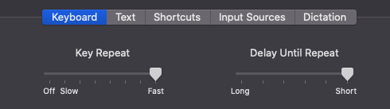
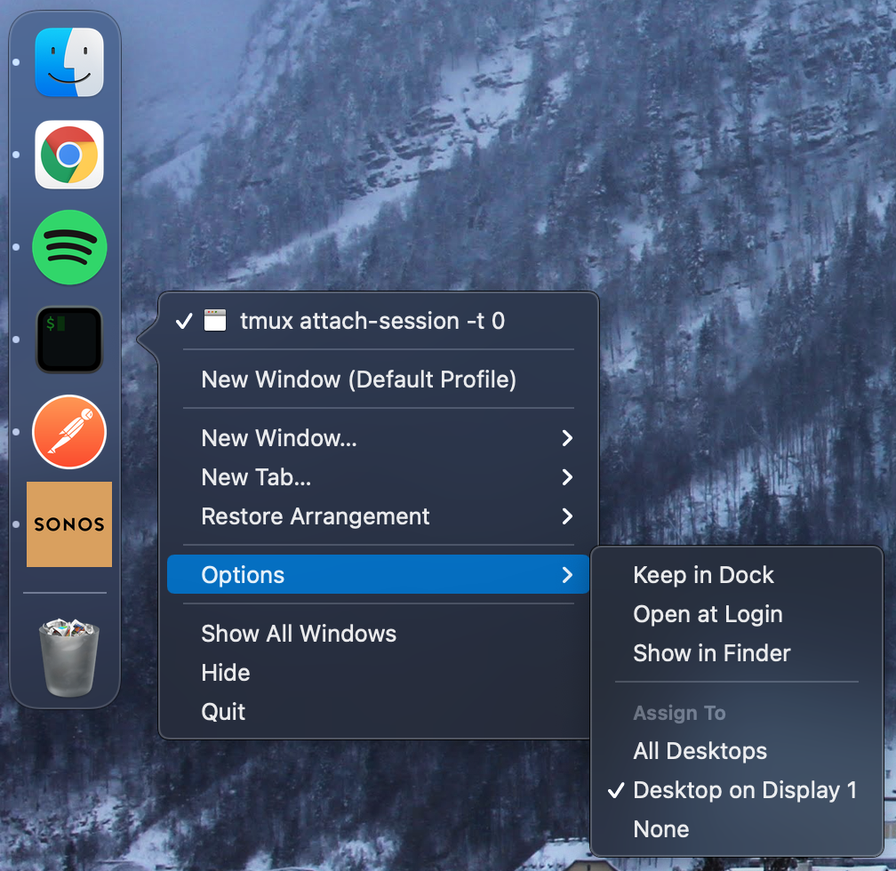
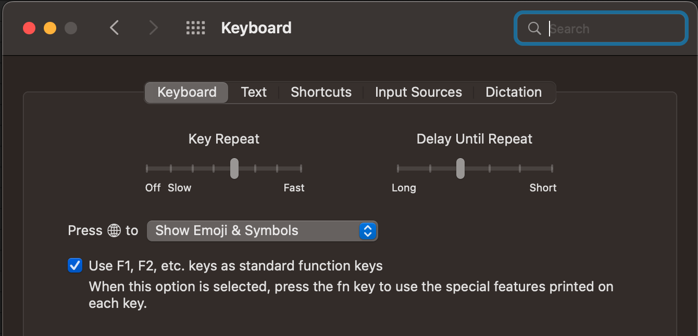

# Modifications

Modifications I make to MacOS to make my experience a bit more nicer.

Keyboard
---

`Settings > Keyboard`

- Key Repeat -> fast
- Delay Until Repeat -> short

Further modifications using `defaults`:



 The above setting corresponds to the following config. `InitialKeyRepeat` corresponds to `Delay Until Repeat`.

```
$ defaults read | grep KeyRepeat
    InitialKeyRepeat = 15;
    KeyRepeat = 2;
    KeyRepeatEnabled = 0;
```

To decrease these values even further, use:

```
defaults write -g InitialKeyRepeat -int 10 # normal minimum is 15 (225 ms)
defaults write -g KeyRepeat -int 1 # normal minimum is 2 (30 ms)
```

More [here](https://apple.stackexchange.com/questions/10467/how-to-increase-keyboard-key-repeat-rate-on-os-x).

Always open window on a specific monitor
---

Create 3 desktops in Mission Control (doesn't work with 2 for some reason).




Function keys on external keyboards
---


