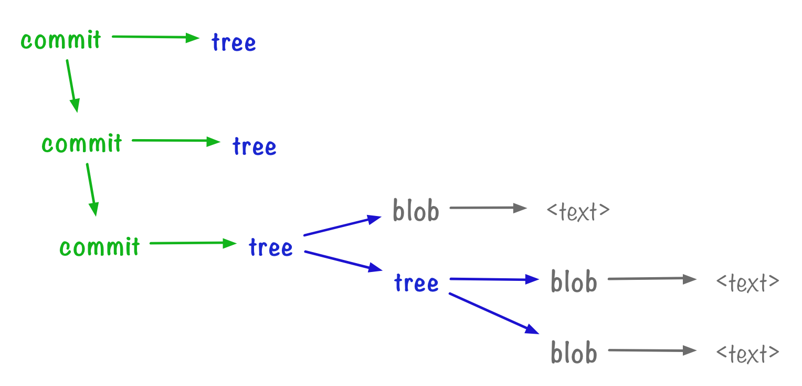

# Git commit-tree

Resources
---

- [Part 3: Context from commits – alexwlchan][1]

<!-- Links -->
[1]: https://alexwlchan.net/a-plumbers-guide-to-git/3-context-from-commits/

<!-- Links end -->


From [[a-plumbers-guide-to-git]]. Related to [[git-write-tree]].

```
.
├── animals.txt
├── animals_copy.txt
└── underwater
    ├── d.txt
    └── e.txt
```

```bash
git write-tree
# 8d5fc21669952dd828232aae1461662eb8a80038

echo "initial commit" | git commit-tree 8d5fc21669952dd828232aae1461662eb8a80038
# 3e6e45584241f2eb95a7ba2460281a1ee01d3573

git cat-file -p 3e6e45584241f2eb95a7ba2460281a1ee01d3573
```

```
tree 8d5fc21669952dd828232aae1461662eb8a80038
author Dhruv Thakur <email> 1670308923 +0100
committer Dhruv Thakur <email> 1670308923 +0100

initial commit
```

A commit has far more context than a tree: it tells us when it was created, who
by, and the free text message lets us include any other relevant details.

Building a linear history
---

Use `-p` flag to point to a parent commit.

```bash
git update-index --add underwater/d.txt

git write-tree
# 32d0ec69a947b0c3bdbd42a0cebafef426bd9b70

echo "new line in d.txt" | git commit-tree 32d0ec69a947b0c3bdbd42a0cebafef426bd9b70 -p 3e6e45584241f2eb95a7ba2460281a1ee01d3573
# 092eb0b62c3eb4466ece5ff6cc9c98b1cf6da0a8

git cat-file -p 092eb0b62c3eb4466ece5ff6cc9c98b1cf6da0a8
```

```
tree 32d0ec69a947b0c3bdbd42a0cebafef426bd9b70
parent 3e6e45584241f2eb95a7ba2460281a1ee01d3573
author Dhruv Thakur <email> 1670309292 +0100
committer Dhruv Thakur <email> 1670309292 +0100

new line in d.txt
```

How it fits into the bigger picture
---



[//begin]: # "Autogenerated link references for markdown compatibility"
[a-plumbers-guide-to-git]: ../a-plumbers-guide-to-git/a-plumbers-guide-to-git.md "A Plumbers Guide to Git"
[git-write-tree]: git-write-tree.md "Git write-tree"
[//end]: # "Autogenerated link references"