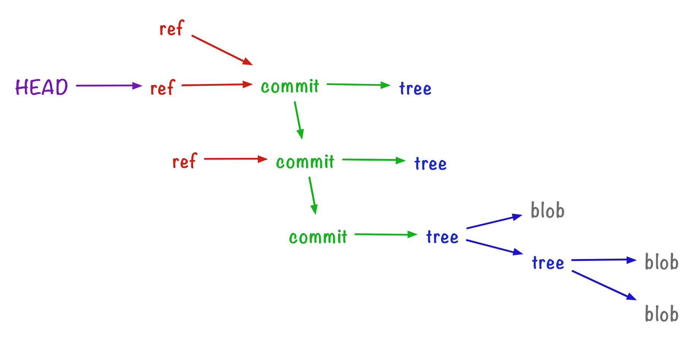

Git refs
===

Resources
---

- [Part 4: Refs and branches – alexwlchan][1]

<!-- Links -->
[1]: https://alexwlchan.net/a-plumbers-guide-to-git/4-refs-and-branches/

<!-- Links end -->


Refs live under `.git/refs`. There are two kinds of refs: `heads` and `tags`.

```bash
find .git/refs -type d
# .git/refs
# .git/refs/heads
# .git/refs/tags

```

Using refs via plumbing commands
---

From [[a-plumbers-guide-to-git]].

### Updating/Creating a ref

```bash
git update-ref refs/heads/master 092eb0b62c3eb4466ece5ff6cc9c98b1cf6da0a8
cat .git/refs/heads/master
# 092eb0b62c3eb4466ece5ff6cc9c98b1cf6da0a8
```

Refs under the `heads` directory are called branches.

### Creating another branch

```bash
git log --oneline
```

```
092eb0b (HEAD -> master) new line in d.txt
3e6e455 initial commit
```

```bash
git update-ref refs/heads/dev 3e6e455
```

This creates a ref at `.git/refs/heads/dev`. That’s all a branch is – a pointer
file.

### HEAD ref

`HEAD` is a special ref that lives in `.git/HEAD`.

```bash
cat .git/HEAD
# ref: refs/heads/master
```

Changing HEAD:

```bash
git symbolic-ref HEAD refs/heads/dev
```

### Using Tags via refs

```bash
git update-ref refs/tags/v0.1 dev

git log --oneline
```

```
092eb0b (HEAD -> master) new line in d.txt
3e6e455 (tag: v0.1, dev) initial commit
```

```bash
cat .git/refs/tags/v0.1
# 3e6e45584241f2eb95a7ba2460281a1ee01d3573
```

Similar to branches, a tag is just a lightweight pointer.

### Overall view

Here's how refs fit in the picture with commits, trees, and blobs.



[//begin]: # "Autogenerated link references for markdown compatibility"
[a-plumbers-guide-to-git]: ../a-plumbers-guide-to-git/a-plumbers-guide-to-git.md "A Plumbers Guide to Git"
[//end]: # "Autogenerated link references"