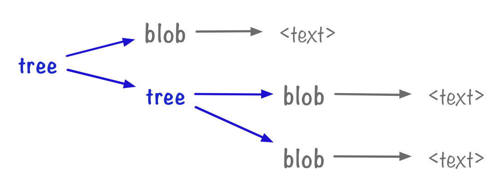

# Git write-tree

Resources
---

- [Part 2: Blobs and trees – alexwlchan][1]

<!-- Links -->
[1]: https://alexwlchan.net/a-plumbers-guide-to-git/2-blobs-and-trees/

<!-- Links end -->


From [[a-plumbers-guide-to-git]].

`write-tree` is a plumbing command.

```
.
├── animals.txt
├── animals_copy.txt
└── underwater
    ├── d.txt
    └── e.txt
```

```bash
git update-index --add animals.txt
git update-index --add underwater/d.txt
git update-index --add underwater/e.txt

# This will create 3 objects under .git/objects (all blobs)

git write-tree
# 56cce7867ca48d55b3fe5ad49c92f16e648d6225
# This will create 2 more objects under .git/objects (both trees)

git cat-file -p 56cce7867ca48d55b3fe5ad49c92f16e648d6225
# 100644 blob 5e7d431e528424312265caea6b150ff54023ab92    animals.txt
# 040000 tree 8972388aa2e995eb4fa0247ccc4e69144f7175b9    underwater

git cat-file -t 5e7d431e528424312265caea6b150ff54023ab92
# blob
git cat-file -t 8972388aa2e995eb4fa0247ccc4e69144f7175b9
# tree

git cat-file -p 8972388aa2e995eb4fa0247ccc4e69144f7175b9
# 100644 blob cb68066907dd99eb75642bdbd449e1647cc78928    d.txt
# 100644 blob 9968b7362a7c97e237c74276d65b68ca20e03c47    e.txt

```

`write-tree` stores a list of pointers to other objects (one per row).

The four columns in each row are:
 - 100644 is the file permissions. Git only distinguishes between 644
     (non-executable) and 755 (executable).
 - blob is the type of the object (more on that below).
 - The ID of the file contents (which are saved with `git hash-object`)
 - animals.txt is the name of that file.



[//begin]: # "Autogenerated link references for markdown compatibility"
[a-plumbers-guide-to-git]: ../a-plumbers-guide-to-git/a-plumbers-guide-to-git.md "A Plumbers Guide to Git"
[//end]: # "Autogenerated link references"
