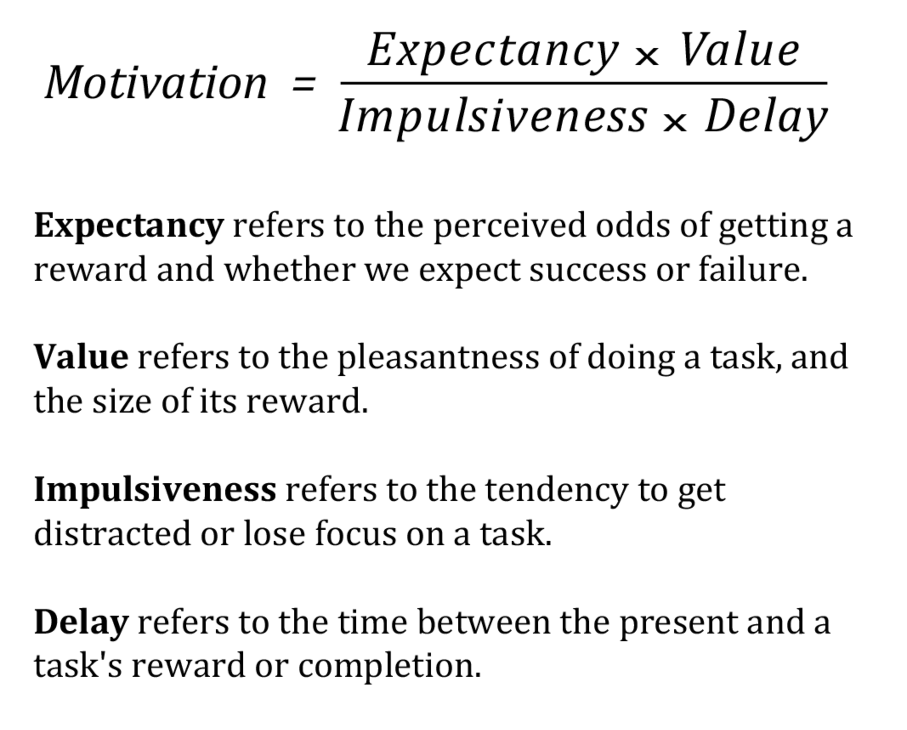

The Procrastination Equation
===

Resources
---

- [How to Get Motivated: A Guide for Defeating Procrastination][1]
- [The Procrastination Equation: How to Stop Putting Things Off and Start Getting Stuff Done][2]

<!-- Links -->
[1]: https://alexvermeer.com/getmotivated/
[2]: https://www.amazon.com/Procrastination-Equation-Putting-Things-Getting/dp/0061703621/

<!-- Links end -->


Comes from [this][2] book.



The Equation
---

```
             Expectancy x Value
Motivation = ---------------------
             Impulsiveness x Delay
```

- `Expectancy` refers to the perceived odds of getting a reward and whether we
  expect success or failure.
- `Value` refers to the pleasantness of doing a task, and the size of its
    reward.
- `Impulsiveness` refers to the tendency to get distracted or lose focus on a
    task.
- `Delay` refers to the time between the present and a task's reward or
  completion.

How to Get Motivated
---

The solution is simple. To increase motivation and decrease procrastination you
must:

- Increase our `Expectancy` of success and the certainty of being rewarded.
- Increase the `Value` and pleasantness of doing a task.
- Decrease our `Impulsiveness` by removing distractions and maintaining focus.
- Decrease the `Delay` of the reward by having more immediate, salient
    deadlines.
